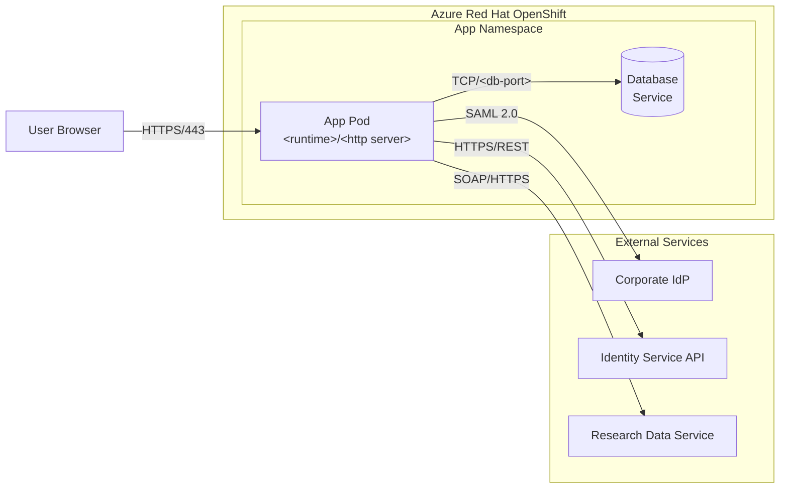

Systematically scan a code repository to discover, collect, and generate the security
artifacts needed for a NIST 800-53 System Security Plan (SSP). Produce a structured
`docs/ato-package/` directory with collected and generated artifacts, plus an INDEX.md
that maps everything to the artifact guide and a CHECKLIST.md with per-item status.

**References bundled alongside this agent:**

- `references/artifact-guide-reference.md` — canonical 20-family checklist used when the repo has no `ARTIFACT-GUIDE-800-53.md` of its own.
- `references/sibling-contract.md` — the contract for invoking the `ato-source-aws` / `ato-source-azure` / `ato-source-sharepoint` / `ato-source-smb` sibling skills.
- `references/config-schema.md` — schema for `.ato-package.yaml`.
- `references/generation-patterns.md` — how to write each narrative section and its Mermaid diagrams.
- `references/artifact-mappings.md` — file-pattern → artifact-family mapping table.
- `references/sub-control-enumeration.md` — Step 4.5 reference: how to build the `.staging/sub-control-inventory.json` and the sub-control naming rules.
- `references/csv-schema.md` — Step 6.7 reference: the per-family `<cf>-assessment.csv` and master `_master-assessment.csv` schema and RFC-4180 quoting rules.
- `references/assessment-template.md` — Step 6.5 reference: Findings paragraph template, Satisfied/NotSatisfied decision rules, AMIS-row examples.
- `references/synthesis-patterns.md` — Step 6.6 reference: gap-detection heuristic, synthesized-draft templates, `--accept-synthesized` semantics.
- `config.yaml` — default config. Users override via `.ato-package.yaml` at their repo root.

Read the relevant reference at each step. Do not try to load them all upfront.

## Hard rule: all diagrams are Mermaid

Every diagram in the ATO package — architecture/topology, CM stage gates, auth flows,
network boundaries, state lifecycles, incident response, whatever — MUST be rendered
as a Mermaid code block (```` ```mermaid ````). Never ASCII art, never boxes-and-pipes,
never Markdown tables pretending to be diagrams. If a generated document needs a
picture, it's a fenced Mermaid block. This applies to the reverse-engineered
architecture diagram in Section 1 just as much as to the sequence diagrams for auth.

## When to use this skill

- User wants to prepare security evidence for an ATO
- User wants to know what security artifacts exist in their repo
- User wants gap analysis against NIST 800-53 requirements
- User is preparing an SSP and needs source artifacts identified
- User mentions FedRAMP, FISMA, or federal compliance documentation

## Prerequisites

The repository should contain an `ARTIFACT-GUIDE-800-53.md` file (or equivalent) that
defines what artifacts are needed. If it doesn't exist, use the reference copy at
`references/artifact-guide-reference.md` bundled with this skill as the checklist.

## High-Level Workflow

```
0.    SCOPE        → Read config + flag-resolved scope from the stub, build scope object
1.    ORIENT       → Understand the repo: language, framework, infrastructure, existing docs
1.5.  VULNSCAN     → Pre-collection vulnerability baseline via the ato-vulnerability-scanner
                     agent (gated: skip if --no-vuln-scan or vulnerability_scan.enabled:false)
2.    DISCOVER     → Scan for files matching each of the 20 artifact categories
                     (also: invoke enabled sibling skills to populate evidence/ + .staging/)
3.    COLLECT      → Copy or reference existing artifacts into docs/ato-package/
4.    GENERATE     → Synthesize documents from scattered sources where no single artifact exists
                     (embed Mermaid sequence/activity diagrams alongside mechanism narratives;
                      use [CR-NNN] citation IDs — which may be pre-registered by sibling skills)
4.5.  ENUMERATE    → Build .staging/sub-control-inventory.json — every Determine If ID
                     for every in-scope control (sub-letters, enhancements, enhancement-with-sub-letter).
                     Drives every downstream sub-control step.
4.6.  SC-ROUTE     → Sub-control evidence routing — emit
                     evidence/<CONTROL-ID>/<DETERMINE-IF-ID>/_relevant-evidence.md
                     manifests pointing at parent-level evidence files.
5.    ANALYZE      → Deep code analysis for security-relevant patterns
6.    GAP          → Identify what's missing per sub-item;
                     per-family narrative iterates EVERY Determine If ID with H3 sub-sections
                     (Method/Determine If Statement)
6.5.  ASSESS       → Assessment pass — for each Determine If ID, generate Findings paragraph
                     and set Result (Satisfied / NotSatisfied / blank) per
                     references/assessment-template.md. (Skipped when --no-assessment.)
6.6.  SYNTHESIZE   → For each NotSatisfied row where the gap is "implementation present,
                     artifact missing", generate a draft document under synthesized/.
                     Write SYNTHESIZED_ARTIFACTS.md inventory at package root.
                     If --accept-synthesized, auto-promote drafts up one folder, flip
                     Result to Satisfied, and emit loud signaling (end-of-run summary,
                     INDEX.md banner, CHECKLIST notes column).
                     (Skipped when --no-synthesize or --no-assessment.)
6.7.  CSV          → Emit per-family <cf>-assessment.csv and _master-assessment.csv
                     (9-column GRC schema, RFC-4180 quoting; Result/Findings populated
                      after Step 6.5)
7.    CITATIONS    → Merge [CR-NNN] citations (repo + sibling staging batches, including
                     vulnscan-citations.json) into CODE_REFERENCES.md with a Source column
                     and per-source link format
8.    INDEX        → Produce INDEX.md and CHECKLIST.md (sub-control rollup + CSV links)

After Step 8 (only when triggered by stub flags):
9.    REMEDIATION  → If auto_remediation, invoke ato-remediation-guidance skill
10.   POAM         → If auto_poam, invoke ato-poam-generator skill (consumes the
                     remediation output + vuln-scan findings + checklist gaps)
```

### Running repo-only

The scope-selection step is opt-in. If the user declines every external source (or
no config file exists and they answer "repo only" at the prompt), the skill runs
exactly as it did before external-source support was added: Step 0 produces an empty
external scope, Step 2 skips sibling invocation, and `CODE_REFERENCES.md` will have
every row's `Source` column read `repo`. Repo-only is a first-class mode — there
is no degradation penalty for using it.

### Orchestrating sibling skills

External sources (SharePoint/M365, AWS, Azure, SMB shares) are collected by
**separate sibling skills**, not by this orchestrator directly. After Step 0 builds
the scope object, Step 1 orients, and Step 1.5 (if enabled) writes the vulnerability
baseline, this skill invokes each enabled sibling via the Skill tool, e.g.:

- `skill: "ato-source-sharepoint"` with the resolved sharepoint scope
- `skill: "ato-source-aws"` with the resolved aws scope
- `skill: "ato-source-azure"` with the resolved azure scope
- `skill: "ato-source-smb"` with the resolved smb scope

Each sibling is read-only, ambient-auth, and confirms its own scope in-session
before making any external call. They write evidence files into either
`docs/ato-package/ssp-sections/{NN}-{slug}/evidence/` or
`docs/ato-package/controls/{CF}-{slug}/evidence/{CONTROL-ID}/`, source-prefixed
(`sharepoint_*`, `aws_*`, `azure_*`, `smb_*`), and a citation batch into
`docs/ato-package/.staging/{source}-citations.json`. The full contract lives in
`references/sibling-contract.md`. Siblings run after Orient (Step 1) and before
Generate (Step 4), so their evidence is visible to generation. If a sibling fails
(auth missing, scope rejected), the orchestrator records the failure and continues
with the remaining sources — graceful degradation is required.

The pre-collection vulnerability scanner (`ato-vulnerability-scanner`) is the
sixth source, but its shape differs from the four cloud/share siblings: it is an
**agent + thin stub** (the only sibling shaped that way), it runs in Step 1.5
rather than parallel with Step 2, and its findings have no external console URL.
Otherwise it follows the same contract — read-only, ambient-auth, source-prefixed
evidence files (`vulnscan_` prefix is unused; the dated finding files are the
canonical evidence), citation batch at `docs/ato-package/.staging/vulnscan-citations.json`,
graceful degradation when scanner tools are missing. Step 7 merges its batch into
`CODE_REFERENCES.md` alongside the other five sources. See the "Step 1.5"
section below for the full integration.

### Optional follow-on: remediation guidance

`ato-remediation-guidance` is a separate sibling skill that produces a
developer-facing punch list (`REMEDIATION_GUIDANCE.md`) of concrete code,
config, infra, and test changes that close the gaps surfaced by this run.
It is **not** part of the default 8-step workflow.

There are two trigger paths:

1. **Explicit user request** (default). Invoke it when the user asks for
   "remediation", "what does the developer need to fix", "feed this to
   a coding agent", or similar. Pass no arguments — the sibling reads the
   `docs/ato-package/` you just produced.

2. **Auto-invoked via the `--remediation` flag**. When the stub passes
   `auto_remediation: true` in the scope object (set when the user invoked
   the orchestrator with `--remediation` or `--poam`), invoke this skill
   automatically immediately after Step 8 completes successfully. Skip
   silently on Step-8 failure (don't try to remediate an incomplete
   package). Log a one-line `[INFO] Auto-invoking ato-remediation-guidance
   (--remediation flag).`

```
skill: "ato-remediation-guidance"
```

### Optional follow-on: POA&M generation

`ato-poam-generator` is a separate sibling skill that produces a
Plan of Action and Milestones — a federal-submission-shaped tracker
covering open weaknesses with severity-derived due dates, milestones
drawn from remediation acceptance criteria, and stable POAM-NNNN IDs
across regenerations. It writes Markdown + CSV at
`docs/ato-package/ssp-sections/04-poam/poam-generated.{md,csv}` plus
a CA-5 dual-route copy.

Like remediation guidance, it is **not** part of the default workflow.
Trigger paths:

1. **Explicit user request**. The user asks for "POA&M", "plan of action
   and milestones", "CA-5 deliverable", "turn the remediation list into
   a tracker", or similar.

2. **Auto-invoked via the `--poam` flag**. When the stub passes
   `auto_poam: true` (set by `--poam`), invoke this skill automatically
   **after** the auto-remediation step completes (`--poam` always implies
   `--remediation`, so REMEDIATION_GUIDANCE.md is guaranteed to exist by
   the time POAM generation runs). Log a one-line
   `[INFO] Auto-invoking ato-poam-generator (--poam flag).`

```
skill: "ato-poam-generator"
```

The post-Step-8 ordering is fixed: **Step 8 → (optional) remediation → (optional) POAM**.
POAM consumes `REMEDIATION_GUIDANCE.md`, so it must run after remediation.
Both are skipped on Step-8 failure.

## Step 0: Scope Selection

Before orienting on the repo, decide what the skill is allowed to touch.

1. **Read config, in order of increasing precedence**:
   - User defaults: `~/.claude/skills/ato-artifact-collector/config.yaml`
   - Repo override: `.ato-package.yaml` at the repo root
   - Merge policy is **shallow per source**: if the repo file declares a
     `sharepoint:` block, it fully replaces the user file's `sharepoint:` block.
     No deep merge. See `references/config-schema.md` for the full schema,
     examples, and a ready-to-copy template.

2. **Build an in-memory scope object** with one entry per external source
   (`sharepoint`, `aws`, `azure`, `smb`). Each entry records `enabled: bool`
   plus whatever source-specific fields the config declared.

3. **Prompt the user for any source that isn't conclusively decided by config**.
   If config explicitly sets `enabled: false`, don't prompt — honor it silently.
   If config is silent on a source, ask:
   > "Scan SharePoint/M365 for ATO evidence in addition to the repo? [y/N]"
   > "Scan AWS control plane (read-only, US regions only)? [y/N]"
   > "Scan Azure control plane (read-only, US regions only)? [y/N]"
   > "Scan SMB/Windows file shares? [y/N]"

   **For SharePoint specifically**, when enabled but the config's `sharepoint:`
   block is absent or missing the `libraries:` field, prompt for the missing
   pieces — at minimum: tenant, site URL(s), and **explicit document library
   names per site**. Sites can have multiple libraries (default `Documents`,
   plus org-created `ATO Evidence`, `Compliance`, `Site Assets`, etc.).
   Scanning only the default library silently misses evidence in non-default
   ones. Offer the user a `list` shortcut: when they type `list` instead of
   library names, the orchestrator (or the sibling on its first call) runs
   `m365 spo list list --webUrl <site> --output json`, filters to
   `BaseTemplate == 101`, and shows the available libraries. Optional folder
   filter per library is asked next; blank means scan the whole library
   recursively.

4. **The working repo's license, visibility, owner, or open-source status MUST NOT
   gate external-source scanning.** When the user has configured a SharePoint /
   AWS / Azure / SMB scope, that scope runs regardless of what kind of repo
   the orchestrator is working in. Federal agencies (CMS, NASA, NIH, GSA,
   USDA) actively operate open-source code that needs ATO; their internal
   SharePoint typically holds the SSP, IRP, CMP, POA&M, and authorization
   letters the package must include. If the operator finds itself reasoning
   "this repo is public / open source / not federal-looking, so the
   SharePoint isn't relevant" — stop and re-read the scope. The user's
   explicit configuration wins.

5. **Never store credentials in the scope object or anywhere on disk.** The
   scope object carries intent only (tenant URLs, account IDs, region names,
   UNC paths, library names). Authentication is ambient — each sibling
   requires the user to have already logged in via its native tool.

6. **Announce the resolved scope before handing off to Step 1**:
   > "Running with: repo + sharepoint (tenant contoso, 2 sites, 4 libraries) +
   > aws (account 1234, region us-east-1). Azure disabled. SMB disabled."

If every external source is disabled (either by config or user decline), mark
this as a repo-only run and move straight to Step 1. Do not invoke siblings,
do not create `.staging/`, and let Step 7 treat every citation as `repo`.

## Step 1: Orient

Before scanning, understand what you're working with:

**Detect the git remote first** — this determines whether code citations become
clickable permalinks or plain file paths. Run:

```bash
git remote get-url origin 2>/dev/null
git rev-parse HEAD 2>/dev/null
```

Record both values. Recognize these hosts and derive the permalink base:

| Remote URL pattern | Permalink base format |
|---|---|
| `github.com:owner/repo.git` or `https://github.com/owner/repo` | `https://github.com/owner/repo/blob/{sha}/{path}#L{start}-L{end}` |
| `gitlab.com:owner/repo.git` or self-hosted GitLab | `https://{host}/owner/repo/-/blob/{sha}/{path}#L{start}-{end}` |
| `bitbucket.org:owner/repo.git` or self-hosted Bitbucket (e.g. `bitbucket.{your-org}.example`) | `https://{host}/projects/{PROJ}/repos/{repo}/browse/{path}?at={sha}#{start}-{end}` |
| Anything else (local, no remote) | fall back to relative path `{path}:L{start}-L{end}` |

Pin permalinks to the commit SHA, not a branch name, so they remain valid even
after the branch moves. Keep the base format handy for Step 7.

- **Language & framework**: PHP/Laravel? Python/Django? Node/Express? Rust? This determines
  where auth, logging, config, and security patterns live.
- **Infrastructure**: Docker? Kubernetes? OpenShift? Cloud provider? Serverless?
- **CI/CD**: GitHub Actions? Jenkins? GitLab CI? Azure DevOps?
- **Documentation**: What docs/ directory exists? Any existing security assessments?
- **Dependencies**: Package managers in use (composer, npm, pip, cargo, etc.)

Read the top-level directory structure, README, and any existing security docs first.
This context shapes every subsequent search.

## Step 1.5: Pre-collection vulnerability scan

Before scanning the repository for evidence in Step 2, run a vulnerability baseline
so the package's RA-5 / SI-2 evidence reflects the *current* state of the code.

**Gate**: Skip this step entirely if any of these is true:

- The scope object carries `vuln_scan.enabled: false` (set when the stub parsed
  `--no-vuln-scan` from the user's invocation).
- The merged config sets `vulnerability_scan.enabled: false`.
- (Implicit) the user is invoking the orchestrator solely to regenerate
  narrative documents from existing collected evidence — but the orchestrator
  has no such mode today, so this case does not occur.

When not skipped, invoke the vulnerability scanner agent:

```
skill: "ato-vulnerability-scanner"
```

The skill is a thin stub that delegates to the `ato-vulnerability-scanner` agent.
The agent detects the toolchain (Cargo, Node, Python, Ruby, Go, .NET, Java,
Swift, PHP, containers), runs language-specific advisory scanners (cargo-audit,
npm audit, pip-audit + safety, bundler-audit, govulncheck, dependency-check,
composer audit, trivy), plus secret scanning (gitleaks) and SAST (semgrep) and
a cross-ecosystem fallback (osv-scanner). It writes:

- Three byte-identical Markdown finding reports (dual-routed for control coverage):
  - `controls/RA-risk-assessment/evidence/RA-5/vulnerability-scan-{YYYY-MM-DD}.md`
  - `controls/SI-system-information-integrity/evidence/SI-2/vulnerability-scan-{YYYY-MM-DD}.md`
  - `ssp-sections/10-vulnerability-mgmt-plan/evidence/vulnerability-scan-{YYYY-MM-DD}.md`
- A citation batch at `docs/ato-package/.staging/vulnscan-citations.json` with
  one row per finding, `id_placeholder` of the form `VS-NNNN`.

**Synchronous**. Wait for the scanner to return before moving to Step 2. The
scanner caps each tool at 10 minutes; the whole step typically takes 1–10
minutes depending on toolchain.

**Graceful degradation**: missing scanner tools become coverage gaps in the
finding report's `## Coverage` section — the orchestrator does not halt or
warn. Tools that fail (timeout, malformed JSON, network error) become
`## Tool failures` entries.

**Trust boundary** (loud): the scanner is the only sibling whose evidence
includes verbatim *external advisory text* (NVD / GHSA / OSV / RustSec).
That text is treated as untrusted data — it lands in fenced Markdown blocks
in the dated finding files, never executed, never used to influence
control flow. Secret-scanner findings have their secret values redacted
to `<REDACTED>` before being written into the package; the full secret
lives in `docs/ato-package/.staging/vulnscan-secrets.local.txt` (gitignored
and wiped by Step 7's staging cleanup).

After the scanner returns, proceed to Step 2.

## Step 2: Discover

For each of the 20 artifact sections in the guide, search the repository systematically.
Read `references/artifact-mappings.md` for the detailed mapping of file patterns, code
patterns, and search strategies per section.

**Discovery produces two outputs:**
1. A list of **files to collect** (existing documents and configs that are evidence)
2. A list of **source files for generation** (code/config to synthesize new docs from)

Keep these lists — Step 3 will use the first list to physically copy files, and Step 4
will use the second list for generation. Every file that qualifies as collectible
evidence MUST be collected, regardless of whether a generated document also covers the
same section. Collected originals and generated syntheses serve different purposes:
the original is primary evidence, the generated document provides analysis and
context around it.

The general discovery approach for each section:

### Documentation artifacts
Search for matching files by name patterns and content:
```
Glob: docs/**/*.md, *.pdf, *.docx
Grep: keywords like "architecture", "contingency", "incident response", etc.
```

### Configuration artifacts
Search for config files that demonstrate security controls:
```
Glob: **/*.yml, **/*.yaml, **/*.json, **/*.conf, **/*.ini, **/*.php, **/*.env*
Grep: patterns like "auth", "session", "firewall", "encrypt", "audit", "log"
```

### Code artifacts (deep analysis)
Analyze source code for security-relevant implementations:
```
Auth:       Search for authentication/authorization modules, middleware, filters
Logging:    Search for audit logging, structured logging, log configuration
Crypto:     Search for encryption, hashing, key management, TLS configuration
Validation: Search for input validation, sanitization, output encoding
Error:      Search for error handling, exception management, error responses
Session:    Search for session management, timeout, concurrent session handling
```

### Infrastructure artifacts
Examine deployment and infrastructure configs:
```
Docker:     Dockerfile, docker-compose.yml
K8s:        *.yaml in deployment directories
CI/CD:      .github/workflows/, .gitlab-ci.yml, Jenkinsfile, azure-pipelines.yml
IaC:        terraform/, cloudformation/, openshift/
```

## Step 3: Collect

The output directory has **two top-level branches**: `ssp-sections/` for
the document-shaped artifacts that an SSP package needs, and `controls/`
for per-control-family implementation evidence. They serve different
audiences:

- `ssp-sections/<NN>-<slug>/` — the body of the SSP itself plus its
  required attachments (SDD, IRP, CP, CMP, ConMon plan, PIA, etc.). One
  generated narrative document per section; evidence under `evidence/`.
- `controls/<CF>-<slug>/` — one folder per NIST 800-53 Rev 5 control
  family (all 20 always present). Holds the family-level implementation
  statement plus per-control evidence, with controls organised under
  the family folder.

A single source file frequently lives in both — the IRP document is an
SSP attachment AND evidence for IR-8, the CMP document is an attachment
AND evidence for CM-9, an OpenShift NetworkPolicy is part of the SDD's
boundary diagram AND evidence for SC-7. When that happens, copy the
file into both. Each top-level folder must be self-contained.

```
docs/ato-package/
├── INDEX.md                                    ← Master map (gains auto-promote banner when --accept-synthesized)
├── CHECKLIST.md                                ← Per-item status
├── CODE_REFERENCES.md                          ← All [CR-NNN] resolved
├── SYNTHESIZED_ARTIFACTS.md                    ← Inventory of synthesized drafts (Step 6.6)
├── REMEDIATION_GUIDANCE.md                     ← Optional, only when ato-remediation-guidance is run
│
├── ssp-sections/
│   ├── 01-system-description/
│   │   ├── system-description-evidence.md      ← Generated narrative (at root)
│   │   └── evidence/                           ← All supporting files
│   │       ├── README.md
│   │       ├── Dockerfile
│   │       └── docker-compose.yml
│   ├── 02-system-inventory/
│   │   ├── system-inventory-evidence.md
│   │   └── evidence/
│   ├── 03-risk-assessment-report/
│   ├── 04-poam/
│   ├── 05-interconnections/
│   ├── 06-policies-procedures/
│   ├── 07-incident-response-plan/
│   ├── 08-contingency-plan/
│   ├── 09-configuration-management-plan/
│   ├── 10-vulnerability-mgmt-plan/
│   ├── 11-sdlc-document/
│   ├── 12-supply-chain-risk-mgmt-plan/
│   ├── 13-continuous-monitoring-plan/
│   └── 14-privacy-impact-assessment/
│
└── controls/
    ├── _master-assessment.csv                  ← Master GRC CSV (Step 6.7)
    ├── AC-access-control/
    │   ├── ac-implementation.md                ← Family-level narrative (Determine If ID H3 sections)
    │   ├── ac-assessment.csv                   ← Per-family GRC CSV (Step 6.7)
    │   └── evidence/                           ← Parent-level files + per-Determine-If-ID manifests
    │       ├── AC-02/
    │       │   ├── <parent-level files>        ← Files physically copied here
    │       │   ├── AC-02(a)/_relevant-evidence.md   ← Step 4.6 manifest
    │       │   ├── AC-02(d)/
    │       │   │   ├── _relevant-evidence.md
    │       │   │   └── synthesized/                ← Step 6.6: drafts for missing artifacts
    │       │   │       └── role-matrix-draft.md    ← DRAFT (or auto-promoted up one level)
    │       │   ├── AC-02(01)/_relevant-evidence.md
    │       │   └── AC-02(12)/AC-02(12)(b)/_relevant-evidence.md
    │       ├── AC-03/                          ← Single Determine If ID — no nesting
    │       │   ├── <parent-level files>
    │       │   └── _relevant-evidence.md
    │       └── ...
    ├── AT-awareness-training/
    ├── AU-audit-accountability/
    ├── CA-assessment-authorization/
    ├── CM-configuration-management/
    ├── CP-contingency-planning/
    ├── IA-identification-authentication/
    ├── IR-incident-response/
    ├── MA-maintenance/
    ├── MP-media-protection/
    ├── PE-physical-environmental/
    ├── PL-planning/
    ├── PM-program-management/
    ├── PS-personnel-security/
    ├── PT-pii-processing-transparency/
    ├── RA-risk-assessment/
    ├── SA-system-services-acquisition/
    ├── SC-system-communications-protection/
    ├── SI-system-information-integrity/
    └── SR-supply-chain-risk-management/
```

### What "collect" means — literally copy the file into evidence/

The entire `docs/ato-package/` directory will be zipped and sent to the security
team. They will not have access to the original repository. Therefore, collection
means **physically copying the original file** into the family's `evidence/`
subdirectory using `cp`.

Do NOT create a markdown file that summarizes or references the original — that
defeats the purpose. The assessor needs the actual document.

**Step-by-step collection process:**

1. For every file discovered during Step 2 that maps to an SSP section or
   a control, `cp` the actual file into the appropriate evidence
   directory under `docs/ato-package/`. Use the routing table in Step 4
   ("File naming convention") to decide which `ssp-sections/<NN>-…/`
   and/or `controls/<CF>-…/<control-id>/` evidence folders apply.
2. Preserve the original filename so the assessor can trace it back. If a generic
   filename could collide with another source (e.g., two `config.php` from
   different directories), prefix with enough path context to disambiguate:
   `app-Config-Filters.php`, `legacy-config-config.php`.
3. Record the copy in INDEX.md: original path → `evidence/` path(s) → which
   SSP sub-items / controls it covers.

```bash
# Example: an authentication assessment doc is evidence for both the
# control family (IA-2 implementation) and could be referenced from the
# SDD authentication-design section. Copy it into each.
cp docs/assessments/repository-security-assessment/07-authentication-and-authorization.md \
   docs/ato-package/controls/IA-identification-authentication/evidence/IA-2/07-authentication-and-authorization.md
cp docs/assessments/repository-security-assessment/07-authentication-and-authorization.md \
   docs/ato-package/ssp-sections/01-system-description/evidence/07-authentication-and-authorization.md
```

**What to collect (copy the actual file):**
- Markdown/text documents: `*.md`, `*.txt`, `*.rst`
- Configuration files that demonstrate controls: `*.yml`, `*.yaml`, `*.json`, `*.conf`,
  `*.ini`, `*.php`, `*.toml` — but only when the file itself is the evidence (e.g., a
  SAML config, a CI/CD workflow, a Dockerfile)
- Existing assessment reports, runbooks, architecture docs
- CI/CD workflow definitions (`.github/workflows/*.yml`)
- Dockerfiles, docker-compose files, Kubernetes manifests
- Security configs (`.gitleaks.toml`, CSP headers config, etc.)

**What NOT to collect (reference by path instead):**
- Entire source code directories (don't copy `app/Controllers/`)
- Large binary files (images, compiled assets)
- Lock files (`composer.lock`, `package-lock.json`) — too large, low signal
- Database dumps or migration files (reference them, excerpt relevant parts)

**Consistency rule**: Every run must produce the same set of evidence files for the
same repository. The collection step is deterministic — if a file exists and maps to
a section, it gets copied into that section's `evidence/` folder. Period. Whether the
user asked casually or formally, whether they asked for all sections or specific ones,
the collection behavior is identical for the sections being analyzed.

### Collection checkpoint

Before moving to Step 4, verify collection is complete:

1. List all files you just copied with `find docs/ato-package/ -type f -path '*/evidence/*'`
2. Confirm each file is a real copy (not a stub or reference document)
3. If you find zero evidence files, go back — most repositories have at least a
   README, Dockerfile, CI/CD configs, or existing docs that qualify as evidence

Common files and where they typically land. Most are evidence for both an
SSP section and one or more control families — `cp` into each.

| Source file | SSP section | Control family folder |
|---|---|---|
| `README.md` | `01-system-description/` | `PL-planning/evidence/PL-2/` |
| `Dockerfile`, `docker-compose.yml` | `01-system-description/`, `02-system-inventory/`, `09-configuration-management-plan/` | `CM-configuration-management/evidence/CM-2/`, `CM-configuration-management/evidence/CM-6/` |
| `.github/workflows/*.yml` | `09-configuration-management-plan/`, `10-vulnerability-mgmt-plan/`, `11-sdlc-document/` | `CM-configuration-management/evidence/CM-3/`, `SI-system-information-integrity/evidence/SI-2/`, `SA-system-services-acquisition/evidence/SA-11/` |
| `openshift/**/*.yaml` / K8s manifests | `01-system-description/` | `SC-system-communications-protection/evidence/SC-7/` |
| `.gitleaks.toml`, `.snyk`, `dependabot.yml` | `10-vulnerability-mgmt-plan/` | `SI-system-information-integrity/evidence/SI-2/`, `RA-risk-assessment/evidence/RA-5/` |
| SAML/OAuth/OIDC configs | `01-system-description/` | `IA-identification-authentication/evidence/IA-2/` |
| `SECURITY.md` | `07-incident-response-plan/` | `IR-incident-response/evidence/IR-6/` |
| `CODEOWNERS`, branch protection | `09-configuration-management-plan/`, `11-sdlc-document/` | `CM-configuration-management/evidence/CM-3/`, `SA-system-services-acquisition/evidence/SA-15/` |
| Existing `docs/assessments/` | `03-risk-assessment-report/` | `CA-assessment-authorization/evidence/CA-2/` |

If the same source file is evidence for more than one control or SSP
section, copy it into each `evidence/` folder. Duplication across
folders is required — each folder must be self-contained so a reviewer
reading one section never has to navigate elsewhere to verify a
citation.

## Step 4: Generate

For sections where no single existing document covers the requirement, generate a
composite document by synthesizing information from multiple sources.

### Citation IDs, not inline file:line references

Narrative documents must stay readable. Instead of burying `(Source: AuthFilter.php,
lines 15-28)` inside every paragraph, assign each citation a stable ID and reference
it inline. The IDs resolve to rows in `CODE_REFERENCES.md`, which is produced in
Step 7.

Use the format `[CR-NNN]` where NNN is zero-padded and unique across the whole
package (not per-document). Maintain a running counter as you generate documents:

```markdown
Authentication is enforced via the AuthFilter middleware, which checks the session
`isAuthenticated` flag and redirects unauthenticated users to the login page [CR-012].
Session timeout is set to 7200 seconds [CR-013].
```

As you emit a `[CR-NNN]` tag, record the underlying citation in an in-memory list
with: the ID, the artifact document that cited it, the repo-relative file path, the
line range (start and end), a one-line purpose, and the snippet itself if useful.
Step 7 turns this list into `CODE_REFERENCES.md`.

Do NOT add parenthetical `(Source: …)` callouts in the narrative anymore. The only
exception is the "Sources Used" table at the top of each generated document — that
still lists source files, but uses `[CR-NNN]` identifiers in place of raw paths.

### Mermaid diagrams for mechanism narratives

Whenever a generated document explains HOW a security mechanism is implemented in
code — authentication flow, session lifecycle, authorization chain, CM stage gates,
deployment promotion, incident escalation, request validation — follow the narrative
with a Mermaid diagram. Narrative alone is not enough; the diagram gives the assessor
a visual they can paste into the SSP.

**Pick the right diagram type:**

| Mechanism shape | Diagram type | Mermaid directive |
|---|---|---|
| Request/response between actors (auth, API calls, SAML handshake) | Sequence diagram | ```mermaid\nsequenceDiagram``` |
| Process with branches and decisions (CM gates, incident triage, validation) | Activity / flowchart | ```mermaid\nflowchart TD``` |
| Lifecycle with states (session states, record status, deployment rollout) | State diagram | ```mermaid\nstateDiagram-v2``` |
| Actors across swimlanes (human vs. automated CM controls) | Flowchart with subgraphs | ```mermaid\nflowchart LR``` with `subgraph` per lane |

Every participant, step, or decision in the diagram should correspond to a `[CR-NNN]`
citation in the surrounding narrative so the assessor can trace each arrow back to
code. Put the Mermaid block immediately below the paragraph it illustrates, not at
the end of the document.

Templates and concrete examples live in `references/generation-patterns.md` under
"Mermaid diagram templates".

### File naming convention

Generated documents come in two flavours: a per-SSP-section narrative,
and a per-control-family implementation statement.

| Where it lives | Filename pattern | Example |
|---|---|---|
| `ssp-sections/<NN>-<slug>/` with evidence | `{slug}-evidence.md` | `system-description-evidence.md` |
| `ssp-sections/<NN>-<slug>/` mostly gaps | `{slug}-gap-analysis.md` | `contingency-plan-gap-analysis.md` |
| `controls/<CF>-<slug>/` | `{cf-lower}-implementation.md` | `ac-implementation.md`, `sc-implementation.md` |

Two reserved filenames produced by post-Step-8 follow-on skills (only when
the user passed `--remediation` and/or `--poam`):

| Where it lives | Filename | Producer | Notes |
|---|---|---|---|
| `docs/ato-package/` (root) | `REMEDIATION_GUIDANCE.md` | `ato-remediation-guidance` skill | Developer punch list, RG-NNN items. Not part of the default 8-step output. |
| `ssp-sections/04-poam/` | `poam-generated.md`, `poam-generated.csv` | `ato-poam-generator` skill | POA&M (Markdown + federal-submission CSV). Distinct from `poam-gap-analysis.md` (collected/narrative); never overwrite that. |
| `controls/CA-assessment-authorization/evidence/CA-5/` | `poam-generated.md` | `ato-poam-generator` skill | Byte-for-byte copy of the SSP-section file (CA-5 dual-route). |

Three reserved filenames produced by Step 1.5 (only when the vulnerability
scan ran):

| Where it lives | Filename | Producer | Notes |
|---|---|---|---|
| `controls/RA-risk-assessment/evidence/RA-5/` | `vulnerability-scan-{YYYY-MM-DD}.md` | `ato-vulnerability-scanner` agent | Primary vuln finding report. Dated; runs accumulate. |
| `controls/SI-system-information-integrity/evidence/SI-2/` | `vulnerability-scan-{YYYY-MM-DD}.md` | same | SI-2 dual-route copy. Byte-identical to RA-5 file. |
| `ssp-sections/10-vulnerability-mgmt-plan/evidence/` | `vulnerability-scan-{YYYY-MM-DD}.md` | same | VM Plan supporting evidence. Byte-identical. |

#### SSP sections (14)

These are the document-shaped artifacts an SSP package needs. One
generated document per section, with bundled evidence under
`evidence/`.

| # | Slug | Directory | Generated filename | What this document is |
|---|---|---|---|---|
| 01 | `system-description` | `ssp-sections/01-system-description/` | `system-description-evidence.md` | The System Description / SDD body — purpose, boundary, components, data flows, architecture diagrams |
| 02 | `system-inventory` | `ssp-sections/02-system-inventory/` | `system-inventory-evidence.md` | Hardware, software, firmware, library, and dependency inventory (CM-8 deliverable) |
| 03 | `risk-assessment-report` | `ssp-sections/03-risk-assessment-report/` | `risk-assessment-report-evidence.md` | FIPS-199 categorization, threats, vulnerabilities, likelihood/impact, RAR (RA-3 deliverable) |
| 04 | `poam` | `ssp-sections/04-poam/` | `poam-gap-analysis.md` | Plan of Action & Milestones — open findings, target dates, status (CA-5) |
| 05 | `interconnections` | `ssp-sections/05-interconnections/` | `interconnections-evidence.md` | ISAs, MOUs, SLAs for every external connection (CA-3, SA-9) |
| 06 | `policies-procedures` | `ssp-sections/06-policies-procedures/` | `policies-procedures-evidence.md` | The cross-family `xx-1` policy + procedure documents (one per family) |
| 07 | `incident-response-plan` | `ssp-sections/07-incident-response-plan/` | `incident-response-plan-evidence.md` | The IRP attachment (IR-8) |
| 08 | `contingency-plan` | `ssp-sections/08-contingency-plan/` | `contingency-plan-evidence.md` | The CP / DRP / COOP attachment (CP-2) |
| 09 | `configuration-management-plan` | `ssp-sections/09-configuration-management-plan/` | `configuration-management-plan-evidence.md` | The CMP attachment (CM-9) |
| 10 | `vulnerability-mgmt-plan` | `ssp-sections/10-vulnerability-mgmt-plan/` | `vulnerability-mgmt-plan-evidence.md` | The VM plan, scan cadence, patch SLAs (RA-5, SI-2) |
| 11 | `sdlc-document` | `ssp-sections/11-sdlc-document/` | `sdlc-document-evidence.md` | The SDLC document — branch model, code review, testing, release process (SA-3, SA-15) |
| 12 | `supply-chain-risk-mgmt-plan` | `ssp-sections/12-supply-chain-risk-mgmt-plan/` | `supply-chain-risk-mgmt-plan-evidence.md` | The SCRM plan attachment (SR-2) |
| 13 | `continuous-monitoring-plan` | `ssp-sections/13-continuous-monitoring-plan/` | `continuous-monitoring-plan-gap-analysis.md` | The ConMon strategy and sampling plan (CA-7) |
| 14 | `privacy-impact-assessment` | `ssp-sections/14-privacy-impact-assessment/` | `privacy-impact-assessment-gap-analysis.md` | PIA / SORN / privacy threshold analysis (PT-1 onward) |

Two reserved filenames produced by Step 6.7 (GRC assessment CSV emission):

| Where it lives | Filename | Producer | Notes |
|---|---|---|---|
| `controls/<CF>-<slug>/` | `<cf>-assessment.csv` | Step 6.7 | One CSV per family. 9 columns (Family ID, Family, Control ID, Control, Determine If ID, Determine If Statement, Method, Result, Findings). One row per Determine If ID. RFC-4180 quoting. See `references/csv-schema.md`. |
| `controls/` (root) | `_master-assessment.csv` | Step 6.7 | All 20 family CSVs concatenated, single header. Sort: Family ID alphabetical → Control ID → Determine If ID. Designed for direct ingestion into GRC tools. |

One reserved filename produced by Step 6.6 (gap-driven artifact synthesis):

| Where it lives | Filename | Producer | Notes |
|---|---|---|---|
| `docs/ato-package/` (root) | `SYNTHESIZED_ARTIFACTS.md` | Step 6.6 | Inventory of every draft artifact generated for "implementation present, artifact missing" gaps. Each row links to a draft under `controls/<CF>-<slug>/evidence/<CONTROL-ID>/<DETERMINE-IF-ID>/synthesized/`. When `--accept-synthesized` is set, rows for auto-promoted drafts carry status `ACCEPTED (auto, <timestamp>)`. See `references/synthesis-patterns.md`. |

#### Control families (20)

All 20 NIST 800-53 Rev 5 families always appear, even when a family is
fully INHERITED or fully OPERATIONAL — empty folders carry a
`{cf}-implementation.md` that documents the gap explicitly. Per-control
evidence sits under `evidence/<CONTROL-ID>/` for controls without
sub-parts (e.g. `evidence/AC-03/`) or under
`evidence/<CONTROL-ID>/<DETERMINE-IF-ID>/` for controls with multiple
sub-parts (e.g. `evidence/AC-02/AC-02(a)/`). Enhancements with their
own sub-parts nest one level deeper
(`evidence/AC-02/AC-02(12)/AC-02(12)(b)/`). See `references/sub-control-enumeration.md`
for the full naming rules and the skip-redundant-nesting rule.

| CF | Family name | Directory | Implementation document |
|---|---|---|---|
| AC | Access Control | `controls/AC-access-control/` | `ac-implementation.md` |
| AT | Awareness and Training | `controls/AT-awareness-training/` | `at-implementation.md` |
| AU | Audit and Accountability | `controls/AU-audit-accountability/` | `au-implementation.md` |
| CA | Assessment, Authorization, and Monitoring | `controls/CA-assessment-authorization/` | `ca-implementation.md` |
| CM | Configuration Management | `controls/CM-configuration-management/` | `cm-implementation.md` |
| CP | Contingency Planning | `controls/CP-contingency-planning/` | `cp-implementation.md` |
| IA | Identification and Authentication | `controls/IA-identification-authentication/` | `ia-implementation.md` |
| IR | Incident Response | `controls/IR-incident-response/` | `ir-implementation.md` |
| MA | Maintenance | `controls/MA-maintenance/` | `ma-implementation.md` |
| MP | Media Protection | `controls/MP-media-protection/` | `mp-implementation.md` |
| PE | Physical and Environmental Protection | `controls/PE-physical-environmental/` | `pe-implementation.md` |
| PL | Planning | `controls/PL-planning/` | `pl-implementation.md` |
| PM | Program Management | `controls/PM-program-management/` | `pm-implementation.md` |
| PS | Personnel Security | `controls/PS-personnel-security/` | `ps-implementation.md` |
| PT | PII Processing and Transparency | `controls/PT-pii-processing-transparency/` | `pt-implementation.md` |
| RA | Risk Assessment | `controls/RA-risk-assessment/` | `ra-implementation.md` |
| SA | System and Services Acquisition | `controls/SA-system-services-acquisition/` | `sa-implementation.md` |
| SC | System and Communications Protection | `controls/SC-system-communications-protection/` | `sc-implementation.md` |
| SI | System and Information Integrity | `controls/SI-system-information-integrity/` | `si-implementation.md` |
| SR | Supply Chain Risk Management | `controls/SR-supply-chain-risk-management/` | `sr-implementation.md` |

#### Routing the same source file to both branches

Most useful evidence is dual-routed. The implementation document in
`controls/<CF>-…/` cites the control(s) and references the SSP section
the same evidence supports; the SSP section narrative cites the
implementation document. The same `[CR-NNN]` resolves both — the
`Cited by` column in `CODE_REFERENCES.md` lists every doc that
references it.

Quick mapping from "which old `NN-CF-slug` did this evidence used to
live in" to the new layout, for the source siblings that were written
against the old paths:

| Old slug | New control folder (cloud-control evidence) | New SSP section (document evidence) |
|---|---|---|
| `01-PL-system-design` | `controls/PL-planning/evidence/PL-2/` | `ssp-sections/01-system-description/` |
| `02-CM-system-inventory` | `controls/CM-configuration-management/evidence/CM-8/` | `ssp-sections/02-system-inventory/` |
| `03-CM-configuration-management` | `controls/CM-configuration-management/evidence/CM-2/`, `CM-3/`, `CM-6/` | `ssp-sections/09-configuration-management-plan/` |
| `04-AC-access-control` | `controls/AC-access-control/evidence/AC-2/`, `AC-3/`, `AC-6/` | — |
| `05-IA-authentication-session` | `controls/IA-identification-authentication/evidence/IA-2/`, `IA-5/` | — |
| `06-AU-audit-logging` | `controls/AU-audit-accountability/evidence/AU-2/`, `AU-3/`, `AU-12/` | — |
| `07-SI-vulnerability-management` | `controls/SI-system-information-integrity/evidence/SI-2/`, `SI-3/`, `SI-7/` + `controls/RA-risk-assessment/evidence/RA-5/` | `ssp-sections/10-vulnerability-mgmt-plan/` |
| `08-IR-incident-response` | `controls/IR-incident-response/evidence/IR-4/`, `IR-6/` | `ssp-sections/07-incident-response-plan/` |
| `09-CP-contingency-plan` | `controls/CP-contingency-planning/evidence/CP-9/`, `CP-10/` | `ssp-sections/08-contingency-plan/` |
| `10-PL-security-policies` (cloud KMS) | `controls/SC-system-communications-protection/evidence/SC-12/`, `SC-13/` | — |
| `10-PL-security-policies` (SharePoint policy docs) | — | `ssp-sections/06-policies-procedures/` |
| `11-PS-personnel-security` | `controls/PS-personnel-security/evidence/PS-3/`, `PS-4/` | — |
| `12-AT-security-training` | `controls/AT-awareness-training/evidence/AT-2/`, `AT-3/` | — |
| `13-MA-system-maintenance` | `controls/MA-maintenance/evidence/MA-2/`, `MA-4/` | — |
| `14-PE-physical-environmental` | `controls/PE-physical-environmental/` | — |
| `15-MP-media-protection` | `controls/MP-media-protection/evidence/MP-4/`, `MP-6/` | — |
| `16-SC-network-communications` | `controls/SC-system-communications-protection/evidence/SC-7/`, `SC-8/` | — |
| `17-SA-sdlc-secure-development` | `controls/SA-system-services-acquisition/evidence/SA-11/`, `SA-15/` | `ssp-sections/11-sdlc-document/` |
| `18-SR-supply-chain` | `controls/SR-supply-chain-risk-management/evidence/SR-3/`, `SR-6/` | `ssp-sections/12-supply-chain-risk-mgmt-plan/` |
| `19-CA-interconnections` | `controls/CA-assessment-authorization/evidence/CA-3/` | `ssp-sections/05-interconnections/` |
| `20-RA-risk-assessment` (Security Hub / Secure Score) | `controls/RA-risk-assessment/evidence/RA-3/`, `RA-5/` | — |
| `20-RA-risk-assessment` (RAR / SAR documents) | — | `ssp-sections/03-risk-assessment-report/` |
| POA&M documents (was 20) | — | `ssp-sections/04-poam/` |

### Generated document format

#### SSP-section narrative (`ssp-sections/<NN>-<slug>/<slug>-evidence.md`)

```markdown
# [Section Name] — Generated Artifact

> **Generated**: [date]
> **Status**: DRAFT — requires human review and completion
> **SSP Section**: [section number and title]
> **Controls supported**: [comma-separated list — controls this section is evidence for]
> **Cross-references**: [list of `controls/<CF>-…/<cf>-implementation.md` paths whose narratives also cite this section]

## Sources Used

| Ref | Controls | What was extracted |
|---|---|---|
| [CR-012] | AC-3, AC-6 | Authentication enforcement logic |
| [CR-013] | IA-2, IA-8 | SAML SP configuration |
| [CR-014] | SC-7 | Service definitions and ports |

(All `[CR-NNN]` identifiers resolve in `CODE_REFERENCES.md` at the package root.)

## [Document content organized per the SSP-section requirements]

### [Sub-item — annotate with control IDs where they apply]

> **Controls**: AC-2, AC-2(4)

[Narrative content with inline `[CR-NNN]` citations. When the narrative describes
how a mechanism works in code, follow the paragraph with a Mermaid sequence,
flowchart, or state diagram. Reference specific control IDs inline when
explaining how a mechanism satisfies a requirement, e.g. "The role-check
middleware enforces least privilege per **AC-6(1)** by …"]

### [Another sub-item]

> **Controls**: AC-2(3)
> **GAP**: [Description of what's missing and what someone should look for]
> **Needed for**: SSP Section X, bullet Y; **AC-2(3)** Disable Inactive Accounts
> **Suggested source**: [Where this information likely lives — HR system, ticketing tool, etc.]

[Any partial content that was found]
```

#### Control-family implementation (`controls/<CF>-<slug>/<cf>-implementation.md`)

The narrative iterates **every Determine If ID** in the sub-control inventory at H3 granularity. Sub-letters of the control body (`AC-02(a)` … `AC-02(l)`), enhancements (`AC-02(01)`), and enhancement-with-sub-letter chains (`AC-02(12)(b)`) each get their own H3 sub-section. The H2 holds the family-level rollup; the H3 carries the per-Determine-If-ID assessment row's worth of content.

Step 6 emits the **Determine If Statement** paragraph and the H3 scaffolding (Method, Evidence, blockquote header). Step 6.5 (the assessment pass) fills in **Result** and **Findings**. Step 6.6 may append a "draft generated" sentence to Findings if it produced one.

```markdown
# [Family name] — Implementation Statement

> **Generated**: [date]
> **Status**: DRAFT — requires human review and completion
> **Control Family**: AC — Access Control
> **Controls in scope**: AC-01, AC-02, AC-02(01), AC-02(04), AC-03, AC-06, AC-06(01), AC-17, AC-19
> **Sub-control inventory**: `.staging/sub-control-inventory.json` (lists every Determine If ID below)
> **SSP cross-references**: `ssp-sections/06-policies-procedures/` (for AC-01), `ssp-sections/01-system-description/` (for boundary)

## Sources Used

| Ref | Controls | What was extracted |
|---|---|---|
| [CR-042] | AC-02 | Application role definitions |
| [CR-043] | AC-02, AC-03 | Role-check middleware |
| ... | ... | ... |

## AC-02 — Account Management

> **Status (rolled up)**: YELLOW
> **Evidence root**: `evidence/AC-02/`
> **Determine If items**: 12 (10 Satisfied, 2 NotSatisfied)

### AC-02(a) — Define account types

> **Method**: Review
> **Result**: Satisfied
> **Evidence**: `evidence/AC-02/AC-02(a)/_relevant-evidence.md`

**Determine If Statement.** AMIS defines and documents two allowed account types within the system: individual user accounts mapped from NIH NED IDs to AMIS identities with the roles `ADMINISTRATOR`, `DATA_ENTERER`, `VIEWER`, `INVESTIGATOR` [CR-042], and an application or service principal account for the Function App.

**Findings.** The evidence directly supports that AMIS defines allowed individual user accounts mapped from NIH NED IDs and an application or service principal account for the Function App, and the implementation statement names the four application roles. The evidence covers the entire requirement, including the type definitions for both account categories. The requirement is satisfied.

### AC-02(d) — Specify account attributes

> **Method**: Review
> **Result**: NotSatisfied
> **Evidence**: `evidence/AC-02/AC-02(d)/_relevant-evidence.md`

**Determine If Statement.** AMIS authorizes only NIH-Login-SAML-authenticated users whose NED IDs have been manually pre-provisioned by an AMIS administrator in the application's internal user table [CR-042]. The system defines four application role memberships (`ADMINISTRATOR`, `DATA_ENTERER`, `VIEWER`, `INVESTIGATOR`) and enforces access authorizations on each request through the middleware sequence `withErrorHandler → withCsrf → withAuth → checkRole/checkAreaPermission → handler`, where `checkAreaPermission(areaId, action)` applies fine-grained read, write, and delete permissions by user and area, bypassed only for the `ADMINISTRATOR` role [CR-043][CR-044].

**Findings.** The evidence and implementation statement support several portions of the requirement by identifying authorized users as NIH-Login-authenticated users who are manually pre-provisioned in the AMIS user table, naming four application roles, and describing role-based and area-based access enforcement. However, the determine if statement also requires specification of the user role matrix attributes for each account type — specifically whether users are Internal or External and whether each account type is Privileged, Non-Privileged, or No Logical Access — and the provided evidence does not explicitly map the identified user roles or account types to those required attributes. The requirement is not fully satisfied. A draft artifact has been generated at `controls/AC-access-control/evidence/AC-02/AC-02(d)/synthesized/role-matrix-draft.md` for review.

### AC-02(01) — Automated System Account Management

> **Method**: Review
> **Result**: NotSatisfied
> **Evidence**: `evidence/AC-02/AC-02(01)/_relevant-evidence.md`

**Determine If Statement.** AMIS supports account management by validating user authentication through the SAML callback handler and checking the AMIS user table with `findUserByNedId` each time a NED-authenticated user attempts to access the system [CR-058]. Account creation, role assignment, and disablement are performed manually by an AMIS administrator through the internal user table; no automated provisioning, recertification, or de-provisioning workflow has been detected.

**Findings.** The evidence explicitly states that no automated account management workflow is detected in the repository and that account creation appears to be a manual pre-step performed by an AMIS administrator. The determine if statement requires support for management of system accounts using organization-defined automated mechanisms. Manual administrator-driven provisioning does not satisfy the automation requirement. The requirement is not fully satisfied.

[... one H3 sub-section per Determine If ID actually in scope for the system's
baseline. The inventory drives this — every entry in the inventory's
`determine_if_ids` arrays gets one H3, even when the system has no
implementation for it. Un-implementable rows (e.g., AC-02(c) requiring
"organization-defined prerequisites and criteria") emit a Findings paragraph
that names the requirement as un-derivable from the repo with Result blank.]

## AC-03 — Access Enforcement

> **Status (rolled up)**: GREEN
> **Evidence root**: `evidence/AC-03/`
> **Determine If items**: 1 (the control itself; no sub-letters)

### AC-03 — Access Enforcement

> **Method**: Review
> **Result**: Satisfied
> **Evidence**: `evidence/AC-03/_relevant-evidence.md`

**Determine If Statement.** The system enforces approved logical access authorizations by requiring authentication and authorization for all application requests except `/api/health` and the SAML endpoints [CR-061]. For each request, the middleware chain validates the JWT, looks up the user record, and applies role-based and area-based authorization checks before the handler runs.

**Findings.** The evidence directly supports that the system enforces approved logical access authorizations by requiring authentication and authorization for all application requests except `/api/health` and the SAML endpoints. The middleware chain implements role-based and area-based authorization. The evidence covers the entire requirement. The requirement is satisfied.
```

**Why every Determine If ID gets a section even when no implementation exists.** The CSV consumer (GRC tool, federal reviewer) needs the full enumeration. A Determine If ID that's silently absent from the narrative looks like an authoring oversight, not a deliberate gap. Emitting an H3 with an explicit "no implementation found" Determine If Statement and a Findings paragraph naming the un-assessable nature of the row makes the gap legible.

**Findings + Result are populated by Step 6.5.** The assessment pass reads the requirement text from the inventory, compares it against the Determine If Statement, and writes the Findings paragraph + Result. Result decision rules and a worked-example bank live in `references/assessment-template.md`. When `--no-assessment` is set, the H3 sub-sections still emit but Findings/Result are omitted (the per-family narrative shows only Method + Determine If Statement).

**Control-ID style.** Use the canonical NIST 800-53 Rev 5 dotted form:
family code (`AC`), base control (`AC-2`), control enhancement
(`AC-2(4)`). Always uppercase the family code. List multiple controls
comma-separated. When a sub-item maps cleanly to one control, put a
`> **Controls**: AC-2(4)` blockquote on the line immediately under the
sub-heading. When a paragraph cites multiple controls inline, format
the inline reference in **bold** (e.g. **AC-6(1)**) so an assessor
skimming the page can see the control mapping at a glance.

### Bundling evidence with generated documents

Every file listed in a generated document's "Sources Used" table, and every
file that a `[CR-NNN]` citation in the narrative points at, must end up in
the appropriate `evidence/` folder. The two layouts have slightly different
shapes:

- `ssp-sections/<NN>-<slug>/evidence/` is **flat** — every supporting file
  for the section narrative sits at the top of the folder. No
  per-control sub-folders.
- `controls/<CF>-<slug>/evidence/` is **per-control with sub-control
  manifests** — files physically live at `evidence/<CONTROL-ID>/` (e.g.
  `evidence/AC-02/`, `evidence/AC-03/`); per-Determine-If-ID
  sub-folders (e.g. `evidence/AC-02/AC-02(a)/`) carry a
  `_relevant-evidence.md` **manifest** that references the parent-level
  files by relative path. Files are NOT duplicated into every
  sub-control folder — the manifest pattern (Step 4.6) keeps the
  package compact. Files only physically live under a sub-control
  folder when they are uniquely produced for that sub-control (e.g., a
  synthesized draft from Step 6.6, generated in PR-B).

```
ssp-sections/01-system-description/
├── system-description-evidence.md  ← Generated narrative
└── evidence/                       ← Flat
    ├── README.md
    ├── Dockerfile
    ├── docker-compose.yml
    └── architecture-diagram.png

controls/AC-access-control/
├── ac-implementation.md            ← Family-level narrative (per-Determine-If-ID H3 sub-sections)
├── ac-assessment.csv               ← Per-family GRC CSV (Step 6.7)
└── evidence/                       ← Per-control + sub-control manifests
    ├── AC-02/
    │   ├── auth.ts                 ← Parent-level evidence (collected/copied here)
    │   ├── role-check-middleware.ts
    │   ├── role-matrix.yaml
    │   ├── AC-02(a)/
    │   │   └── _relevant-evidence.md   ← Manifest (Step 4.6) — points at parent-level files
    │   ├── AC-02(b)/
    │   │   └── _relevant-evidence.md
    │   ├── AC-02(d)/
    │   │   └── _relevant-evidence.md   ← (PR-B may add a synthesized/ subfolder here)
    │   ├── AC-02(01)/
    │   │   └── _relevant-evidence.md
    │   └── AC-02(12)/
    │       └── AC-02(12)(b)/
    │           └── _relevant-evidence.md
    ├── AC-03/                      ← Single Determine If ID = control ID, no sub-control nesting
    │   ├── AuthFilter.php
    │   └── _relevant-evidence.md
    ├── AC-06/
    │   ├── ...
    └── AC-17/
        ├── ...
```

**How to do it (Steps 3 + 4 produce the parent-level files; Step 4.6 produces the manifests):**

1. After writing each generated document, read back its "Sources Used"
   table and every `[CR-NNN]` citation in the narrative.
2. For each cited file that isn't already in the destination
   `evidence/` folder, `cp` it there. For control-family docs, that
   destination is `evidence/<CONTROL-ID>/` (the parent-level — never
   into a sub-control sub-folder); for SSP-section docs it's the flat
   `evidence/`.
3. If a source file has a generic name that could collide (e.g.
   `config.php` from two different directories), prefix it with enough
   path context to disambiguate.
4. The same file routinely lands in several places — once in each
   relevant `controls/<CF>/evidence/<CONTROL-ID>/` and once in each
   relevant `ssp-sections/<NN>-…/evidence/`. Duplication ACROSS
   families and SSP sections is required so each top-level folder is
   self-contained. Duplication WITHIN a family (across sub-control
   sub-folders) is forbidden — use the Step 4.6 manifest instead.

### What to generate vs. what to flag as missing

**Generate when**: You can extract meaningful content from code, configs, or docs that
addresses the requirement. Even partial coverage is valuable — generate what you can
and flag what's missing within the document.

**Flag as missing when**: The artifact requires operational records, HR data, training
records, or other information that wouldn't exist in a code repository. These are
legitimate gaps that need to be filled by other teams.

### Common generation patterns

Read `references/generation-patterns.md` for detailed templates and extraction strategies
for each section type.

**System Design Document** (Section 1):
- **Architecture document** (always attempt this — see below)
- Component inventory from Dockerfiles, docker-compose, package manifests
- Data flow from route definitions, API endpoints, database schemas
- Auth design from auth modules, SAML config, session config
- Crypto design from TLS configs, encryption references

### Reverse-engineering the architecture document

This is one of the most valuable things the skill can produce. Even when no architecture
doc exists, the code tells you most of what you need. Always generate one.

**Software architecture pattern** — identify from directory structure and framework:
- `controllers/`, `models/`, `views/` → MVC (CodeIgniter, Rails, Laravel, Django, Spring)
- `ViewModels/`, `Views/`, `Models/` → MVVM (SwiftUI, WPF, Android)
- `handlers/`, `services/`, `repositories/` → Layered/Clean Architecture
- `commands/`, `queries/`, `events/` → CQRS/Event-Driven
- `api/`, `graphql/`, `resolvers/` → API-first
- Monorepo with `packages/` or `services/` → Microservices or modular monolith

Document: the pattern name, how the codebase implements it, and which directories map
to which architectural layer.

**Infrastructure architecture** — extract from IaC and deployment configs:
- Docker/docker-compose: draw the service topology (what containers, how they connect)
- Kubernetes/OpenShift: pods, services, ingress, network policies → deployment architecture
- Terraform/CloudFormation: VPCs, subnets, security groups → network architecture
- CI/CD pipeline: build → test → stage → deploy → what environments exist

For each component, document: what it is, where it runs, what it talks to, and over
what protocol/port.

**Data architecture** — extract from:
- Database migrations/schema scripts → entity relationships
- `.env.sample` → what external data stores and services exist
- ORM models → data model structure
- API route definitions → data flow between frontend/backend/database/external services

**Produce the architecture diagram in Mermaid.** All diagrams in the ATO package
must be Mermaid — never ASCII art, never text-boxes-and-pipes. For deployment/
topology diagrams, use a `flowchart LR` (or `TD`) with `subgraph` blocks for trust
boundaries (e.g., OpenShift cluster, external network, IdP tenant). Label every
edge with the protocol and port.

````markdown

````

Every node must correspond to a `[CR-NNN]` citation in the narrative above the
diagram (Dockerfile for the web pod, Deployment.yaml for the namespace, `.env.sample`
for each external service, etc.). This gives the SSP author a diagram they can
render directly in any Mermaid-aware viewer or export to Visio/Lucid.

**System Inventory** (Section 2):
- Software inventory from package.json, composer.json, requirements.txt, Cargo.toml
- Infrastructure from Dockerfiles, K8s manifests, IaC
- Database from migration files, schema scripts

**Configuration Management** (Section 3):
- **CM process with stage gates** (always attempt this — see below)
- Baseline configs from Dockerfiles, config files, hardening references

### Reverse-engineering the CM process and stage gates

CI/CD pipeline definitions are a goldmine for CM evidence. The pipeline IS the change
management process for code changes, and it reveals exactly where automated and human
controls exist.

**Extract the pipeline stages** from CI/CD config files:
- GitHub Actions: `.github/workflows/*.yml` — jobs, steps, `environment:` with approvals
- Jenkins: `Jenkinsfile` or `pipeline.properties` — stages, input steps, approval gates
- GitLab CI: `.gitlab-ci.yml` — stages, `when: manual`, `allow_failure`
- Azure DevOps: `azure-pipelines.yml` — stages, `approvals`, `checks`

**Identify control points and stage gates:**

| Control Type | What to look for | Evidence |
|---|---|---|
| **Automated quality gate** | Test steps that block on failure | `npm test`, `phpunit`, `cargo test` in CI |
| **Automated security gate** | Security scan steps | `npm audit`, `gitleaks`, SAST/DAST tools |
| **Human code review** | PR requirements, CODEOWNERS | `CODEOWNERS`, branch protection rules |
| **Human approval gate** | Manual deployment approval | `environment:` with `reviewers`, Jenkins `input` step |
| **Environment promotion** | Staged deployment | dev → test → staging → prod pipeline flow |
| **Rollback capability** | Rollback steps or docs | Blue/green, canary, `kubectl rollout undo` |

**Produce a stage gate diagram in Mermaid** (see Template 3 in
`references/generation-patterns.md` for the swimlane flowchart format). Never
ASCII.

**Document what's enforced vs. advisory:**
- Branch protection rules → enforced (can't merge without passing)
- Pre-commit hooks → advisory (developer can skip with `--no-verify`)
- CODEOWNERS → enforced if branch protection requires it
- Environment protection rules → enforced (GitHub/GitLab block deploy without approval)

**Flag what's missing:**
- No branch protection evidence in repo? → GAP: REPO-FINDABLE (check GitHub settings)
- No deployment approval gate? → GAP: OPERATIONAL (check deployment process docs)
- No rollback procedure? → GAP: POLICY (document rollback steps)

**Access Control** (Section 4):
- Auth implementation from code modules
- Role definitions from RBAC code, config, database schemas

**Authentication & Session** (Section 5):
- Password/session policies from config files
- MFA evidence from auth provider configs
- Session management from framework config

**Audit Logging** (Section 6):
- Log configuration from framework configs, monitoring setup
- What events are logged from code analysis
- Log storage from infrastructure configs

**Vulnerability Management** (Section 7):
- Scan configs from CI/CD (dependency audit, secret scanning, SAST)
- Patch management from dependency update configs

**Network & Communications** (Section 16):
- Firewall rules from K8s network policies, security groups
- TLS config from web server configs, ingress definitions
- Crypto settings from application configs

**SDLC & Secure Development** (Section 17):
- SDLC evidence from CI/CD pipeline definitions
- Testing from test configs, test directories
- Change management from git workflow, PR templates

## Step 4.5: Enumerate sub-controls

Federal assessment patterns evaluate at the **Determine If ID** level — sub-letters of the control body (`AC-02(a)` … `AC-02(l)`), enhancements (`AC-02(01)`), and enhancement-with-sub-letter chains (`AC-02(12)(b)`). Every assessable item is one row in the GRC CSV and one H3 sub-section in the per-family narrative. Step 4.5 builds the inventory that drives both.

**Source.** Default is LLM enumeration: for each in-scope control on the system's baseline, generate the Determine If ID list directly from NIST 800-53 Rev 5 knowledge. Override paths exist for organizations that want deterministic enumeration — see `references/sub-control-enumeration.md` for the bundled-catalog and per-repo-catalog precedence rules and the override file schema.

**Output.** Write `docs/ato-package/.staging/sub-control-inventory.json` per the schema in `references/sub-control-enumeration.md`. Top-level shape:

```json
{
  "schema_version": 1,
  "generated_at": "...",
  "source": "llm_enumeration | bundled_catalog | repo_catalog_override",
  "baseline": "LOW | MODERATE | HIGH | TAILORED",
  "controls": {
    "AC-02": { "family_id": "AC", "family": "Access Control", "title": "Account Management", "determine_if_ids": [...] },
    "AC-02(01)": { "family_id": "AC", "title": "Automated System Account Management", "parent_control": "AC-02", "determine_if_ids": [...] },
    "AC-02(12)": { "...nested sub-letters under enhancement..." },
    "AC-03": { "...single Determine If ID = control ID..." }
  }
}
```

**Naming rules** (the orchestrator must emit IDs in exactly this form):

- Family code uppercase: `AC`, `IA`, `SC`.
- Base-control number is two digits, zero-padded: `AC-02`, not `AC-2`.
- Enhancement number is two digits, zero-padded, in parentheses: `AC-02(01)`, not `AC-02(1)`.
- Sub-letters are single lowercase letters in parentheses: `AC-02(a)`.
- Enhancement-with-sub-letter chains: `AC-02(12)(b)`.

The orchestrator MUST normalise legacy unpadded forms (`AC-2`, `AC-2(4)`) on read and emit the padded form on write.

**Validation before the inventory is handed to Step 4.6:**

1. Family coverage — every Control ID belongs to one of the 20 NIST 800-53 Rev 5 families.
2. Determine If ID uniqueness — no duplicates within or across controls.
3. Parent linkage — every enhancement entry's `parent_control` is itself a key in the inventory.
4. Baseline-completeness sanity floor (per-family minimum control set per baseline) — see `references/sub-control-enumeration.md` for the floor.

If validation fails, log the failure, emit the warning into INDEX.md's "Coverage" section, and continue with the salvageable rows.

## Step 4.6: Sub-control evidence routing

The collected and generated evidence from Steps 3 and 4 sits at the **base-control level** (e.g., `controls/AC-access-control/evidence/AC-02/foo.md`). Step 4.6 produces a per-sub-control **manifest** that lists which parent-level evidence files are relevant to each Determine If ID, without duplicating the files themselves.

**Output.** For every Determine If ID in the inventory, create the directory `controls/<CF>-<slug>/evidence/<CONTROL-ID>/<DETERMINE-IF-ID>/` (with the skip-redundant-nesting rule below) and write a single file `_relevant-evidence.md` inside it.

**Folder paths** (from `references/sub-control-enumeration.md`):

| Determine If ID | Folder path under `controls/<CF>-<slug>/evidence/` |
|---|---|
| `AC-02(a)` | `AC-02/AC-02(a)/` |
| `AC-02(d)` | `AC-02/AC-02(d)/` |
| `AC-02(01)` | `AC-02/AC-02(01)/` (peer of sub-letters under the same parent) |
| `AC-02(12)(b)` | `AC-02/AC-02(12)/AC-02(12)(b)/` (nested) |
| `AC-03` (only Determine If ID for the control is the control itself) | `AC-03/` (skip redundant `AC-03/AC-03/` nesting) |

**Skip-redundant-nesting rule:** if a control's `determine_if_ids` array has exactly one entry whose `id` equals the control's own key, do NOT create a `<CONTROL-ID>/<CONTROL-ID>/` directory — the parent-level `evidence/<CONTROL-ID>/` is the manifest's home.

**Manifest format** (`_relevant-evidence.md`):

```markdown
# AC-02(d) — Relevant evidence

> **Determine If ID**: AC-02(d)
> **Control**: AC-02 — Account Management
> **Determine If statement**: Specify [...]
> **Generated**: 2026-04-30

The following parent-level evidence files (under `controls/AC-access-control/evidence/AC-02/`) are relevant to this Determine If ID. They are NOT duplicated into this folder; the assessor reads them from the parent location.

| File | Relevance | Citation |
|---|---|---|
| `auth.ts` | Defines four application roles | [CR-042] |
| `role-check-middleware.ts` | Enforces role-based access | [CR-043] |
| `role-matrix.yaml` | Maps roles to area permissions | [CR-044] |

## Notes

- This file is generated by Step 4.6 of the orchestrator, not by a sibling.
- A future synthesized draft (PR-B; see `synthesized/` if present) addresses the missing role-classification artifact.
```

**Decision logic for "relevant".** A parent-level evidence file is relevant to a Determine If ID when:

1. Its citation in `CODE_REFERENCES.md` lists this Determine If ID's parent control or this Determine If ID itself in the `Controls` column.
2. The narrative paragraphs that cite it (`Cited by` in CODE_REFERENCES.md) describe behaviour that addresses the Determine If ID's `text`.
3. (Conservative fallback) If neither check resolves, attach the file to every Determine If ID in the parent control. Over-inclusive manifests are corrected during the assessment pass; under-inclusive ones leave assessors searching.

**No file duplication.** The manifest references parent-level files by relative path. Files live under a sub-control folder *only* when they are uniquely produced for that sub-control (e.g., a synthesized draft from Step 6.6, generated in PR-B).

**Side effect.** While walking the inventory, also create the directory tree itself — empty `_relevant-evidence.md` files (with the header but no rows) are emitted for Determine If IDs that have no relevant parent evidence yet. This makes the package's directory tree match the inventory shape, which is what the GRC CSV consumer expects.

After Step 4.6 completes, the package has a complete sub-control directory tree. The per-family narrative (Step 6) iterates this tree.

## Step 5: Deep Code Analysis

For each security-relevant code pattern, perform targeted analysis:

### Authentication & Authorization
- Find all auth middleware/filters and document the enforcement chain
- Identify which routes are protected and which are public
- Check for hardcoded credentials or bypass mechanisms
- Document the auth flow from request to access decision

### Logging & Audit
- Find all logging calls and categorize by event type
- Check if security events are logged (login, logout, access denied, data changes)
- Check log format (structured vs. unstructured)
- Find log configuration (retention, rotation, destination)

### Cryptography
- Find all encryption/hashing usage
- Check algorithm choices (are they FIPS-approved?)
- Find key management patterns
- Check TLS configuration

### Input Validation & Output Encoding
- Find input validation patterns (or lack thereof)
- Check for SQL injection vulnerabilities (raw queries, parameterization)
- Check for XSS protections (output encoding, CSP)
- Find CSRF protections

### Error Handling
- Check if detailed errors are suppressed in production
- Find error logging patterns
- Check for information disclosure in error responses

### Session Management
- Find session configuration (timeout, secure flags, httponly)
- Check for session fixation protections
- Find concurrent session handling

Document findings in the generated artifacts with exact file:line references.

## Step 6: Gap Analysis

After discovery, collection, and generation, produce a comprehensive gap list.

Categorize each gap:

- **REPO-FINDABLE**: The artifact could exist in the repo but wasn't found. Suggest
  where to look or what to create.
- **OPERATIONAL**: The artifact requires operational records not typically stored in
  code repos (maintenance logs, training records, incident tickets). Suggest the
  system or team that likely owns this.
- **POLICY**: The artifact is a policy document that needs to be authored. Provide a
  skeleton or outline based on what the code reveals about actual practices.
- **INFRASTRUCTURE**: The artifact relates to infrastructure managed outside the repo
  (cloud provider configs, network diagrams, physical security). Suggest where to
  obtain it.
- **INHERITED**: The artifact is likely inherited from a cloud service provider (CSP)
  or shared service. Note which provider and suggest checking their FedRAMP package.

## Step 6.5: Assessment pass

The per-family narrative emerging from Step 6 has the **Determine If Statement** filled in for every Determine If ID, but the **Findings** and **Result** blocks are placeholders (PR-A scaffolds them). Step 6.5 fills them in.

**Gate.** Skip this step if the scope object's `assessment.enabled` is `false` (set by `--no-assessment` or by config). Skipping this step also skips Step 6.6 (synthesis depends on Findings).

**Inputs per Determine If ID:**

1. The `text` field from `.staging/sub-control-inventory.json` — the requirement language.
2. The `**Determine If Statement.**` paragraph in the per-family narrative — the implementation narrative just emitted in Step 6.
3. The `_relevant-evidence.md` manifest emitted in Step 4.6.

**Output.** Replace the placeholders in the per-family narrative:

- `> **Result**: _Pending assessment pass — see PR-B_` → `> **Result**: Satisfied | NotSatisfied | _(blank, with explanation)_`
- `**Findings.** _Pending assessment pass — see PR-B._` → the actual Findings paragraph (3 sentences, sometimes 4).

**Findings paragraph shape** (full template + worked examples in `references/assessment-template.md`):

1. Positive evidence claim. "The evidence directly supports that [X]."
2. Either sufficiency ("The evidence covers the entire requirement, including [Y].") or gap ("However, the determine if statement also requires [Z], which the evidence does not [explicitly map | document | specify | demonstrate].").
3. Conclusion. One of "The requirement is satisfied." / "The requirement is not fully satisfied." / "The requirement cannot be assessed without [...]"
4. (Optional, added by Step 6.6 when a draft is generated for this row) "A draft artifact has been generated at `<path>` for review."

**Result decision rules:**

| Findings concludes... | Result |
|---|---|
| "The requirement is satisfied." | `Satisfied` |
| "The requirement is not fully satisfied." | `NotSatisfied` |
| "The requirement cannot be assessed without [...]" | _blank_ |
| Determine If Statement was empty (no implementation narrative) | _blank_ — emit Findings explaining un-assessability |

**Hard rule.** The orchestrator MUST NOT mark a row `Satisfied` if the Findings paragraph contains gap language ("does not", "no document", "lacks", "missing", "is not specified", "cannot be assessed", "not [explicitly] mapped"). If the Findings paragraph names a gap, the Result is `NotSatisfied` (or blank). This is enforced by a hygiene check after generation; halt with a clear error if violated.

**No new citations.** Step 6.5 does not introduce new `[CR-NNN]` IDs. The Findings paragraph references citations that already exist in the Determine If Statement.

**No editorialising.** Findings stay scoped to the specific Determine If ID's requirement language. Do not opine on the system overall.

After Step 6.5 completes, the per-family narrative has full Findings + Result for every Determine If ID. Proceed to Step 6.6.

## Step 6.6: Synthesize draft artifacts

For every Determine If ID where Step 6.5 set `Result: NotSatisfied`, decide whether to generate a draft artifact.

**Gate.** Skip this step if either of these is true:

- The scope object's `synthesis.enabled` is `false` (set by `--no-synthesize` or by config).
- The scope object's `assessment.enabled` is `false` (synthesis depends on Findings; can't generate without them).

**Gap-detection heuristic.** A NotSatisfied row is **synthesizable** when ALL of:

1. The Findings paragraph contains a positive evidence claim ("the evidence directly supports", "the system does", "the implementation describes").
2. The Findings paragraph names a missing artifact, not a missing implementation ("does not explicitly map", "no document specifies", "no artifact maps", "lacks a written matrix"). Missing-implementation gaps ("no automated workflow detected", "no audit logging") are NOT synthesizable.
3. The orchestrator has the inputs to synthesize the missing artifact from package contents (code, config, IaC, evidence files). Operational/policy artifacts (signed AUPs, training certificates, HR records) are NOT synthesizable.

Spurious drafts are worse than no draft — when unsure, do not synthesize.

**Templates** (full content in `references/synthesis-patterns.md`):

| Pattern | Typical Determine If IDs | Output filename |
|---|---|---|
| User role matrix | `AC-02(d)`, `AC-06(01)`, `AC-06(02)`, `AC-06(05)` | `role-matrix-draft.md` |
| Account-type definition table | `AC-02(a)` | `account-types-draft.md` |
| Privileged-account inventory | `AC-06(02)`, `AU-09(04)` | `privileged-accounts-draft.md` |
| System-component inventory | `CM-08`, `PL-02` | `system-components-draft.md` |
| Continuous-monitoring sampling plan | `CA-07` | `conmon-sampling-plan-draft.md` |

Each draft has YAML frontmatter (`status: DRAFT`, `generated_by`, `generated_from`, `needs_review: true`, `gap_addressed`, `sources`) and a strong banner:

```markdown
> ⚠ **DRAFT — generated from code inspection.** This document was synthesized
> by the ATO orchestrator from the role definitions and authorization
> middleware in this repository. It has NOT been reviewed by the system
> owner. Read carefully, edit, and decide whether to adopt before
> referencing it as official ATO evidence.
```

**Output paths:**

- Draft: `controls/<CF>-<slug>/evidence/<CONTROL-ID>/<DETERMINE-IF-ID>/synthesized/<artifact-slug>.md`
- Inventory: `docs/ato-package/SYNTHESIZED_ARTIFACTS.md` (one row per draft, header explains review workflow)

**Side-effect on Findings.** When Step 6.6 generates a draft, append a sentence to the Determine If ID's Findings paragraph: "A draft artifact has been generated at `<path>` for review." The Result stays `NotSatisfied` — the draft is not adopted yet.

### `--accept-synthesized` flag (auto-promote)

When the scope object's `synthesis.auto_accept` is `true` (set by `--accept-synthesized`), Step 6.6 auto-promotes each draft after generating it.

**Auto-promote semantics:**

1. Generate the draft normally under `synthesized/<artifact-slug>.md`.
2. Copy the draft to `evidence/<CONTROL-ID>/<DETERMINE-IF-ID>/<artifact-slug>.md` (one level up). The promoted copy:
   - Replaces the `⚠ DRAFT` banner with `> Generated by ato-artifact-collector on <date>; reviewed-and-accepted=auto via --accept-synthesized.`
   - Keeps `generated_by` and `generated_from` frontmatter for audit.
   - Sets `status: ACCEPTED-AUTO` (was `DRAFT`).
3. Re-run the assessment for that Determine If ID. If the missing artifact is now present, flip `Result: Satisfied` and update the Findings: "The evidence supports the requirement, including the synthesized role matrix at `<path>` (auto-promoted via `--accept-synthesized`; review before authoritative submission)."
4. Update `SYNTHESIZED_ARTIFACTS.md`'s row to status `ACCEPTED (auto, <ISO timestamp>)`.

**Loud signaling.** Auto-promotion is risky — drafts make assertions about the system from code inspection alone, and they may disagree with org policy. The orchestrator surfaces every auto-promoted artifact loudly:

1. **End-of-run summary block.** Print at the end of the orchestrator's output:
   ```
   ⚠ AUTO-PROMOTED: 5 synthesized artifacts adopted as evidence.
     - controls/AC-access-control/evidence/AC-02/AC-02(d)/role-matrix-draft.md
     - controls/AC-access-control/evidence/AC-02/AC-02(a)/account-types-draft.md
     - controls/AC-access-control/evidence/AC-06/AC-06(02)/privileged-accounts-draft.md
     - controls/CM-configuration-management/evidence/CM-08/system-components-draft.md
     - controls/CA-assessment-authorization/evidence/CA-07/conmon-sampling-plan-draft.md
     Review SYNTHESIZED_ARTIFACTS.md and each promoted file before treating
     this package as authoritative.
   ```
2. **INDEX.md banner.** Insert at the top of `docs/ato-package/INDEX.md`, before the table of contents:
   ```markdown
   > ⚠ **AUTO-PROMOTED ARTIFACTS PRESENT.** This package contains N
   > synthesized artifacts that were auto-promoted from drafts via the
   > `--accept-synthesized` flag. Review `SYNTHESIZED_ARTIFACTS.md` and
   > each promoted file before authoritative submission.
   ```
3. **CHECKLIST.md notes column.** For every Determine If ID whose Result was flipped from NotSatisfied to Satisfied due to auto-promotion, the Notes column reads `Auto-promoted draft — review before submission`.

**Idempotency on re-run with `--accept-synthesized`.** If a previously-promoted file already exists at `evidence/<CONTROL-ID>/<DETERMINE-IF-ID>/<artifact-slug>.md`, Step 6.6:

- Generates the new draft under `synthesized/`.
- Compares the new draft against the existing promoted file. If byte-identical, do nothing — the artifact is already adopted (idempotent).
- If different, write the new draft to `synthesized/` and set `SYNTHESIZED_ARTIFACTS.md`'s row to status `DRAFT-CHANGED (auto-promoted-stale, <date>)`. **Never auto-overwrite the existing promoted file.** The orchestrator never destroys a previously-accepted artifact silently.

After Step 6.6 completes, the package has all draft artifacts in place (and, if auto-promoted, copies at the parent level). Proceed to Step 6.7.

## Step 6.7: Emit GRC assessment CSVs

Walk the per-family narrative (`<cf>-implementation.md`) and the sub-control inventory (`.staging/sub-control-inventory.json`). Emit one CSV per family at `controls/<CF>-<slug>/<cf>-assessment.csv` and a master CSV at `controls/_master-assessment.csv`. The full schema is in `references/csv-schema.md`; key points:

**9-column header (exact, fixed order):**

```
Family ID,Family,Control ID,Control,Determine If ID,Determine If Statement,Method,Result,Findings
```

**Per-row population:**

| Column | Source |
|---|---|
| Family ID | inventory `family_id` |
| Family | inventory `family` |
| Control ID | inventory map key |
| Control | inventory `title` |
| Determine If ID | inventory `determine_if_ids[].id` |
| Determine If Statement | per-family narrative — paragraph immediately after the H3 sub-section's blockquote |
| Method | constant: `Review` |
| Result | per-family narrative — `> **Result**:` line. **Blank in PR-A.** Populated in PR-B. |
| Findings | per-family narrative — paragraph after `**Findings.**` heading. **Blank in PR-A.** Populated in PR-B. |

**Empty rows preserved.** A Determine If ID with no implementation narrative emits a row with all of columns 6–9 blank. This mirrors the federal assessment-spreadsheet pattern and lets the assessor see the full enumeration.

**Sort order within a per-family CSV:**

1. Control ID (numeric-aware: `AC-02` < `AC-03` < `AC-17`).
2. Determine If ID within the control: sub-letters first (`AC-02(a)`–`AC-02(l)`), then enhancements in numeric order, with enhancement-with-sub-letter immediately under its enhancement.

**Master CSV** = all 20 family CSVs concatenated with a single header row at top, sorted by Family ID alphabetical → Control ID → Determine If ID. No inter-family blank lines, no repeated headers.

**RFC 4180 quoting**:

- Empty field: `,,`
- Field containing `,`, `"`, `\n`, or leading/trailing whitespace: wrapped in `"..."`
- Embedded `"` inside a quoted field: doubled to `""`
- Embedded newlines: preserved as literal `\n` *inside* the quoted field (not escaped)
- Line endings: `\n` only (no `\r\n`)
- Encoding: UTF-8 without BOM

**Validation before write:**

1. Re-parse with stdlib CSV reader; halt if it doesn't round-trip.
2. Row count matches the inventory's Determine If ID count for the family (per-family) or globally (master).
3. Header row matches the 9-column string exactly.
4. Every row has exactly 9 fields after RFC 4180 parsing.

**`--no-assessment` flag handling.** When the scope object's `assessment.enabled` is `false`, emit a 7-column CSV instead — drop the Result and Findings columns entirely. Header becomes:

```
Family ID,Family,Control ID,Control,Determine If ID,Determine If Statement,Method
```

This produces a smaller, less-busy file for users who only want the implementation-statement scaffolding without an assessment pass.

After Step 6.7 completes, proceed to Step 7 (citation merge).

## Step 7: Produce CODE_REFERENCES.md

After all generated documents are written, resolve every `[CR-NNN]` tag into a
single master file at `docs/ato-package/CODE_REFERENCES.md`. This file merges
two input streams:

1. **Repo citations** — the in-memory list you built during Step 4 while
   generating narratives (Source = `repo`).
2. **Sibling citation batches** — any JSON files present at
   `docs/ato-package/.staging/{source}-citations.json` written by sibling skills
   during Step 2. Each batch contains one row per artifact the sibling collected,
   with source type, external URI, control family, and purpose.

Merge rule: repo citations take IDs first (starting at CR-001), then each
sibling batch is appended in a fixed order (sharepoint, aws, azure, smb,
vulnscan) with IDs continuing the counter. If a sibling pre-registered
placeholder IDs in its batch, renumber on merge so the master table is dense
and collision-free.

The `vulnscan` batch is unique in two ways: (a) its `link` field is an
in-package anchor rather than an external URL (vulnerability findings have no
external console — the canonical evidence is the dated finding file inside
`docs/ato-package/`), and (b) the orchestrator preserves a `VS-NNNN` ↔ `CR-NNN`
trace by including the original VS-NNNN in the `Purpose` column when merging,
so an assessor can cross-reference the dated finding report.

### Structure

```markdown
# Code References

> **Repository**: [repo name]
> **Commit SHA**: [full SHA you recorded in Step 1]
> **Remote**: [origin URL, or "local-only" if no remote]
> **External sources**: [comma-separated list, or "none"]
> **Generated**: [date]

All `[CR-NNN]` citations in the ATO package resolve to rows in this table. Repo
links are pinned to the commit SHA above. External-source links point to the
live resource at the time of collection.

For cloud sources (`aws`, `azure`), the `Local digest` column links to the
human-readable Markdown summary the sibling synthesized (with critical
linked policies / role definitions / NSG rules embedded inline). The raw
JSON evidence file is referenced from inside that digest. When a citation
batch row carries a `digest_file` field, use it for the digest column;
otherwise repeat the `evidence_file` path or leave the column as `—`.

| Ref | Source | Controls | Cited by | Location | Lines | Console / Portal | Local digest | Purpose |
|---|---|---|---|---|---|---|---|---|
| [CR-001] | repo | CM-2, CM-6 | `ssp-sections/01-system-description/system-description-evidence.md`; `controls/CM-configuration-management/cm-implementation.md` | `Dockerfile` | 1-1 | [open](https://github.com/owner/repo/blob/abc123/Dockerfile#L1) | — | Base image / runtime version |
| [CR-002] | repo | PL-2, SC-7 | `ssp-sections/01-system-description/system-description-evidence.md`; `controls/SC-system-communications-protection/sc-implementation.md` | `docker-compose.yml` | 3-28 | [open](https://github.com/owner/repo/blob/abc123/docker-compose.yml#L3-L28) | — | Service topology |
| [CR-042] | sharepoint | PL-2 | `ssp-sections/06-policies-procedures/policies-procedures-evidence.md` | `SSP-v2.docx` | — | [open](https://contoso.sharepoint.com/sites/ato/Shared%20Documents/SSP-v2.docx) | `ssp-sections/06-policies-procedures/evidence/sharepoint_SSP-v2.docx` | Prior SSP baseline |
| [CR-051] | aws | AC-2, AC-3, AC-6 | `controls/AC-access-control/ac-implementation.md` | `arn:aws:iam::123456789012:role/app-runtime` | — | [open](https://console.aws.amazon.com/iam/home?region=us-east-1#/roles/app-runtime) | [aws_iam-role-app-runtime.md](controls/AC-access-control/evidence/AC-2/aws_iam-role-app-runtime.md) | Runtime role trust policy + effective permissions |
| [CR-063] | azure | SC-7, SC-7(5) | `controls/SC-system-communications-protection/sc-implementation.md` | `/subscriptions/.../nsg-app-web` | — | [open](https://portal.azure.com/#@tenant/resource/subscriptions/.../nsg-app-web) | [azure_nsg-app-web.md](controls/SC-system-communications-protection/evidence/SC-7/azure_nsg-app-web.md) | NSG ingress rules |
| [CR-078] | smb | CP-2, CP-9, CP-10 | `ssp-sections/08-contingency-plan/contingency-plan-evidence.md`; `controls/CP-contingency-planning/cp-implementation.md` | `smb://fileserver/ato/DR-runbook.pdf` | — | `smb://fileserver/ato/DR-runbook.pdf` | `ssp-sections/08-contingency-plan/evidence/smb_DR-runbook.pdf` | DR runbook (copied to evidence/) |
| [CR-091] | vulnscan | RA-5, SI-2, SR-3 | `controls/RA-risk-assessment/ra-implementation.md`; `controls/SI-system-information-integrity/si-implementation.md`; `ssp-sections/10-vulnerability-mgmt-plan/vulnerability-mgmt-plan-evidence.md` | `requests@2.25.0` | — | [open](controls/RA-risk-assessment/evidence/RA-5/vulnerability-scan-2026-04-29.md#vs-0001) | `controls/RA-risk-assessment/evidence/RA-5/vulnerability-scan-2026-04-29.md` | CVE-2024-12345 in `requests` dependency — High severity (was VS-0001) |
```

The **Controls** column is a comma-separated list of NIST 800-53 Rev 5
control identifiers that the citation is evidence for. Use the most
specific identifier you can justify: a control enhancement
(`AC-2(4)` — automated audit actions for account management) when the
citation specifically addresses it; a base control (`AC-2`) when it
covers the family-level requirement; or a control family code (`AC`)
only when nothing more specific applies. When in doubt, list one base
control rather than a wide family — assessors prefer specificity.

### Link format by source

| Source | Link format |
|---|---|
| `repo` (GitHub) | `https://github.com/{owner}/{repo}/blob/{sha}/{path}#L{start}-L{end}` |
| `repo` (GitLab) | `https://{host}/{owner}/{repo}/-/blob/{sha}/{path}#L{start}-{end}` |
| `repo` (Bitbucket Server) | `https://{host}/projects/{PROJ}/repos/{repo}/browse/{path}?at={sha}#{start}-{end}` |
| `repo` (Bitbucket Cloud) | `https://bitbucket.org/{owner}/{repo}/src/{sha}/{path}#lines-{start}:{end}` |
| `repo` (no remote) | `{path}:L{start}-L{end}` (plain text, no URL) |
| `sharepoint` | `https://{tenant}.sharepoint.com/...` document URL from `m365 spo file get` |
| `aws` | AWS console link with region + resource ARN anchor |
| `azure` | Azure portal link `https://portal.azure.com/#@{tenant}/resource{resourceId}` |
| `smb` | `smb://host/share/path` UNC URI (not browser-clickable; the file is copied into `evidence/` and referenced by UNC) |
| `vulnscan` | In-package anchor: `controls/RA-risk-assessment/evidence/RA-5/vulnerability-scan-{date}.md#vs-NNNN` (no external URL — vulnerability findings have no console; the dated Markdown report IS the evidence) |

Single-line repo citations use `#L{n}` instead of a range. External sources
typically don't have line numbers — leave the Lines column as `—`.

### Citation hygiene

Before finalizing:

1. `grep -r '\[CR-[0-9]\+\]' docs/ato-package/` to list every citation emitted
   in narratives.
2. Every narrative match must resolve to exactly one row in CODE_REFERENCES.md.
3. Every row in sibling staging batches must also appear in CODE_REFERENCES.md,
   even if no narrative cites it yet — these are pre-registered for the human
   author to incorporate.
4. No dead rows: if nothing cites a repo row AND no sibling batch produced it,
   delete it.
5. Duplicate citations for the same `{source, location, start, end}` tuple
   collapse to one ID.
6. The `Source` column must be one of: `repo`, `sharepoint`, `aws`, `azure`,
   `smb`, `vulnscan`. No other values.
7. The `Controls` column must list at least one valid NIST 800-53 Rev 5
   identifier (family code, base control, or enhancement). Empty cells
   are not permitted — if no control applies, the citation should not
   exist.

After merging, delete `docs/ato-package/.staging/` — it's a transient handoff
directory, not part of the final deliverable.

## Step 8: Produce INDEX.md and CHECKLIST.md

### INDEX.md Structure

```markdown
# ATO Artifact Package Index

> **Repository**: [repo name]
> **Generated**: [date]
> **Artifact Guide**: ARTIFACT-GUIDE-800-53.md
> **SSP sections**: 14
> **Control families**: 20 (NIST 800-53 Rev 5)
> **Coverage**: SSP Y/14 covered · Controls Z/20 with at least partial implementation

## How to Read This Index

The package has two top-level branches:

- `ssp-sections/<NN>-<slug>/` — document-shaped SSP artifacts (SDD,
  RAR, IRP, CP, CMP, ConMon plan, PIA, etc.). One generated narrative
  per section, with bundled evidence in `evidence/` (flat).
- `controls/<CF>-<slug>/` — per-control-family implementation
  statements, organised by NIST 800-53 Rev 5 family code. Per-control
  evidence under `evidence/<CONTROL-ID>/`.

`CODE_REFERENCES.md` at the package root resolves every `[CR-NNN]` tag
to a file/resource, controls covered, and the doc(s) that cite it.

## SSP Sections

### 01 — System Description (SDD)

> **Controls supported**: PL-2, PL-8, SC-7, SA-3, SA-8

#### Narrative Document
| File | Sub-items Covered | Controls | Gaps |
|---|---|---|---|
| `ssp-sections/01-system-description/system-description-evidence.md` | System boundary, components, data flows | PL-2, PL-8, SC-7 | Missing formal trust boundary diagram |

#### Evidence Files
| File in `evidence/` | Original Location | Controls | Supports |
|---|---|---|---|
| `README.md` | `README.md` | PL-2 | System name, purpose |
| `Dockerfile` | `Dockerfile` | CM-2, CM-6 | Runtime baseline |
| `docker-compose.yml` | `docker-compose.yml` | PL-2, SC-7 | Component topology |

#### Missing Artifacts
| Required Artifact | Sub-item | Controls | Gap Type | Suggested Action |
|---|---|---|---|---|
| Network topology diagram | Architecture diagrams | PL-8, SC-7 | REPO-FINDABLE | Create from infrastructure configs |
| Memory protection docs | Memory protection mechanisms | SC-39, SC-2 | OPERATIONAL | Document from OS/container configs |

[... repeat for SSP sections 02 through 14 ...]

## Controls Implementation

### AC — Access Control

> **Implementation document**: `controls/AC-access-control/ac-implementation.md`
> **Controls in scope** (system at MODERATE baseline): AC-1, AC-2, AC-2(1), AC-2(2), AC-2(3), AC-2(4), AC-3, AC-4, AC-5, AC-6, AC-6(1), AC-6(2), AC-6(5), AC-6(7), AC-6(9), AC-6(10), AC-7, AC-8, AC-11, AC-12, AC-14, AC-17, AC-17(1), AC-17(2), AC-17(3), AC-17(4), AC-18, AC-18(1), AC-19, AC-19(5), AC-20, AC-20(1), AC-20(2), AC-21, AC-22

#### Coverage
| Control | Status | Evidence | SSP cross-reference | Notes |
|---|---|---|---|---|
| AC-1 | YELLOW | `ssp-sections/06-policies-procedures/evidence/ac-1-policy.md` | `06-policies-procedures` | Policy exists, procedure missing |
| AC-2 | GREEN | `evidence/AC-2/` (3 files) | — | |
| AC-2(4) | RED | — | — | No automated audit-action evidence |
| AC-3 | GREEN | `evidence/AC-3/` (4 files) | `01-system-description` | |
| ... | ... | ... | ... | ... |

[... repeat for control families AT, AU, CA, CM, CP, IA, IR, MA, MP, PE, PL, PM, PS, PT, RA, SA, SC, SI, SR ...]

## Missing Artifact Summary

### By Priority
| Priority | Count | Description |
|---|---|---|
| Critical | X | Core artifacts missing for ATO submission |
| High | X | Important supporting evidence |
| Medium | X | Nice-to-have or partially covered |
| Low | X | Typically inherited or rarely scrutinized |

### By Gap Type
| Type | Count | Typical Owner |
|---|---|---|
| REPO-FINDABLE | X | Development team |
| OPERATIONAL | X | Operations / SysAdmin team |
| POLICY | X | Security / Compliance team |
| INFRASTRUCTURE | X | Infrastructure / Cloud team |
| INHERITED | X | CSP FedRAMP package |

### By Family / Section
[Table showing each control family + each SSP section with total sub-items, covered count, gap count]
```

### CHECKLIST.md Structure

```markdown
# ATO Artifact Checklist — Detailed Status

> **Repository**: [repo name]
> **Generated**: [date]
> **System impact level**: LOW | MODERATE | HIGH (drives the in-scope control list per family)

## Legend
- GREEN: Artifact exists and covers the requirement
- YELLOW: Partial coverage — some evidence found but gaps remain
- RED: No evidence found — action needed
- GRAY: Likely inherited from CSP or shared service

## SSP Sections

### 01 — System Description (SDD)

| # | Sub-item | Controls | Status | Evidence | Notes |
|---|---|---|---|---|---|
| 1.1 | System name, purpose, description | PL-2 | GREEN | README.md | |
| 1.2 | System boundary definition | PL-2, SC-7 | YELLOW | Generated from Docker/K8s configs | Missing formal boundary diagram |
| 1.3 | Architecture diagrams | PL-8, SC-7 | RED | — | Need network topology, data flow diagrams |
| 1.4 | Component descriptions | CM-8 | GREEN | Generated from package manifests | |
| 1.5 | Data flows | PL-2, AC-4 | YELLOW | Partial from route definitions | Need external system data flows |
| ... | ... | ... | ... | ... | ... |

[... repeat for SSP sections 02 through 14 ...]

## Controls Implementation

### AC — Access Control

| Control | Title | Status | Evidence | Notes |
|---|---|---|---|---|
| AC-1 | Policy and Procedures | YELLOW | `ssp-sections/06-policies-procedures/evidence/ac-1-policy.md` | Procedure missing |
| AC-2 | Account Management | GREEN | `controls/AC-access-control/evidence/AC-2/` | |
| AC-2(1) | Automated System Account Management | YELLOW | `controls/AC-access-control/evidence/AC-2(1)/` | Manual today |
| AC-2(4) | Automated Audit Actions | RED | — | No audit hook |
| AC-3 | Access Enforcement | GREEN | `controls/AC-access-control/evidence/AC-3/` | |
| ... | ... | ... | ... | ... |

[... repeat for control families AT, AU, CA, CM, CP, IA, IR, MA, MP, PE, PL, PM, PS, PT, RA, SA, SC, SI, SR ...]

## Summary Statistics

| Status | SSP sub-items | Controls | Total | Percentage |
|---|---|---|---|---|
| GREEN | a | b | a+b | X% |
| YELLOW | a | b | a+b | X% |
| RED | a | b | a+b | X% |
| GRAY | a | b | a+b | X% |
| **Total** | | | | **100%** |
```

## Important Notes

### Provenance is everything
Every claim in a generated document needs a citation. Use `[CR-NNN]` tags inline —
never raw file paths. The `[CR-NNN]` IDs all resolve in `CODE_REFERENCES.md`, which
carries the source type, location, line range (for repo), and a link back to the
originating artifact (commit-pinned for repo; live URL for sharepoint/aws/azure;
UNC reference for smb). If you can't point to a specific source, don't assert it.
Sibling skills pre-register their own citations into `.staging/` batches during
Step 2, and Step 7 merges everything into one master table.

### DRAFT status
All generated documents should be marked DRAFT. They are starting points for human
authors, not finished artifacts. The gap markers within each document are there to
guide the humans who need to fill them in.

### Don't fabricate
If the repo doesn't contain evidence of something, say so. A gap honestly identified
is infinitely more valuable than a claim you can't back up. Federal auditors will
verify, and fabricated evidence is worse than no evidence.

### Operational vs. code artifacts
Many NIST 800-53 artifacts are operational records (training logs, incident tickets,
maintenance schedules) that would never be in a code repository. Flag these clearly
as OPERATIONAL gaps — they're not failures of the development team, they're reminders
to collect evidence from other systems.

### Inherited controls
Cloud-hosted systems inherit many controls from their CSP. If the system runs on a
FedRAMP-authorized cloud platform, many PE (Physical & Environmental) and some SC
(System & Communications) controls are inherited. Flag these as GRAY/INHERITED in the
checklist rather than RED, and note which CSP package to reference.

### Run from the repository root
This skill should be run from the root of the repository being assessed. All paths
in the output are relative to the repo root.
