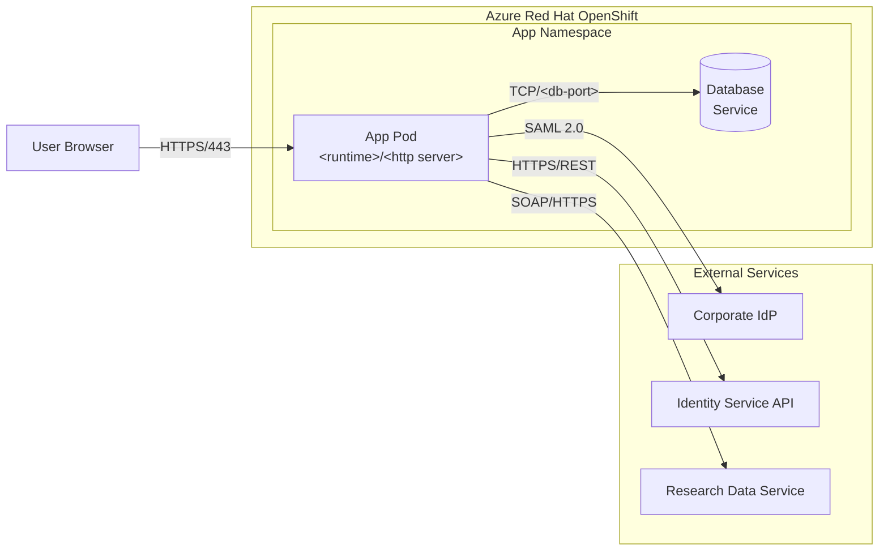

Systematically scan a code repository to discover, collect, and generate the security
artifacts needed for a NIST 800-53 System Security Plan (SSP). Produce a structured
`docs/ato-package/` directory with collected and generated artifacts, plus an INDEX.md
that maps everything to the artifact guide and a CHECKLIST.md with per-item status.

**References bundled alongside this agent:**

- `references/artifact-guide-reference.md` — canonical 20-family checklist used when the repo has no `ARTIFACT-GUIDE-800-53.md` of its own.
- `references/sibling-contract.md` — the contract for invoking the `ato-source-aws` / `ato-source-azure` / `ato-source-sharepoint` / `ato-source-smb` sibling skills.
- `references/config-schema.md` — schema for `.ato-package.yaml`.
- `references/generation-patterns.md` — how to write each narrative section and its Mermaid diagrams.
- `references/artifact-mappings.md` — file-pattern → artifact-family mapping table.
- `config.yaml` — default config. Users override via `.ato-package.yaml` at their repo root.

Read the relevant reference at each step. Do not try to load them all upfront.

## Hard rule: all diagrams are Mermaid

Every diagram in the ATO package — architecture/topology, CM stage gates, auth flows,
network boundaries, state lifecycles, incident response, whatever — MUST be rendered
as a Mermaid code block (```` ```mermaid ````). Never ASCII art, never boxes-and-pipes,
never Markdown tables pretending to be diagrams. If a generated document needs a
picture, it's a fenced Mermaid block. This applies to the reverse-engineered
architecture diagram in Section 1 just as much as to the sequence diagrams for auth.

## When to use this skill

- User wants to prepare security evidence for an ATO
- User wants to know what security artifacts exist in their repo
- User wants gap analysis against NIST 800-53 requirements
- User is preparing an SSP and needs source artifacts identified
- User mentions FedRAMP, FISMA, or federal compliance documentation

## Prerequisites

The repository should contain an `ARTIFACT-GUIDE-800-53.md` file (or equivalent) that
defines what artifacts are needed. If it doesn't exist, use the reference copy at
`references/artifact-guide-reference.md` bundled with this skill as the checklist.

## High-Level Workflow

```
0. SCOPE     → Read config, ask which external sources to scan, build scope object
1. ORIENT    → Understand the repo: language, framework, infrastructure, existing docs
2. DISCOVER  → Scan for files matching each of the 20 artifact categories
               (also: invoke enabled sibling skills to populate evidence/ + .staging/)
3. COLLECT   → Copy or reference existing artifacts into docs/ato-package/
4. GENERATE  → Synthesize documents from scattered sources where no single artifact exists
              (embed Mermaid sequence/activity diagrams alongside mechanism narratives;
               use [CR-NNN] citation IDs — which may be pre-registered by sibling skills)
5. ANALYZE   → Deep code analysis for security-relevant patterns
6. GAP       → Identify what's missing per sub-item
7. CITATIONS → Merge [CR-NNN] citations (repo + sibling staging batches) into
               CODE_REFERENCES.md with a Source column and per-source link format
8. INDEX     → Produce INDEX.md and CHECKLIST.md
```

### Running repo-only

The scope-selection step is opt-in. If the user declines every external source (or
no config file exists and they answer "repo only" at the prompt), the skill runs
exactly as it did before external-source support was added: Step 0 produces an empty
external scope, Step 2 skips sibling invocation, and `CODE_REFERENCES.md` will have
every row's `Source` column read `repo`. Repo-only is a first-class mode — there
is no degradation penalty for using it.

### Orchestrating sibling skills

External sources (SharePoint/M365, AWS, Azure, SMB shares) are collected by
**separate sibling skills**, not by this orchestrator directly. After Step 0 builds
the scope object and Step 1 orients, this skill invokes each enabled sibling via
the Skill tool, e.g.:

- `skill: "ato-source-sharepoint"` with the resolved sharepoint scope
- `skill: "ato-source-aws"` with the resolved aws scope
- `skill: "ato-source-azure"` with the resolved azure scope
- `skill: "ato-source-smb"` with the resolved smb scope

Each sibling is read-only, ambient-auth, and confirms its own scope in-session
before making any external call. They write evidence files into
`docs/ato-package/{NN-family-slug}/evidence/` (source-prefixed: `sharepoint_*`,
`aws_*`, `azure_*`, `smb_*`) and a citation batch into
`docs/ato-package/.staging/{source}-citations.json`. The full contract lives in
`references/sibling-contract.md`. Siblings run after Orient (Step 1) and before
Generate (Step 4), so their evidence is visible to generation. If a sibling fails
(auth missing, scope rejected), the orchestrator records the failure and continues
with the remaining sources — graceful degradation is required.

## Step 0: Scope Selection

Before orienting on the repo, decide what the skill is allowed to touch.

1. **Read config, in order of increasing precedence**:
   - User defaults: `~/.claude/skills/ato-artifact-collector/config.yaml`
   - Repo override: `.ato-package.yaml` at the repo root
   - Merge policy is **shallow per source**: if the repo file declares a
     `sharepoint:` block, it fully replaces the user file's `sharepoint:` block.
     No deep merge. See `references/config-schema.md` for the full schema,
     examples, and a ready-to-copy template.

2. **Build an in-memory scope object** with one entry per external source
   (`sharepoint`, `aws`, `azure`, `smb`). Each entry records `enabled: bool`
   plus whatever source-specific fields the config declared.

3. **Prompt the user for any source that isn't conclusively decided by config**.
   If config explicitly sets `enabled: false`, don't prompt — honor it silently.
   If config is silent on a source, ask:
   > "Scan SharePoint/M365 for ATO evidence in addition to the repo? [y/N]"
   > "Scan AWS control plane (read-only, US regions only)? [y/N]"
   > "Scan Azure control plane (read-only, US regions only)? [y/N]"
   > "Scan SMB/Windows file shares? [y/N]"

4. **Never store credentials in the scope object or anywhere on disk.** The
   scope object carries intent only (tenant URLs, account IDs, region names,
   UNC paths). Authentication is ambient — each sibling requires the user to
   have already logged in via its native tool.

5. **Announce the resolved scope before handing off to Step 1**:
   > "Running with: repo + sharepoint (tenant contoso, 2 sites) + aws (account
   > 1234, region us-east-1). Azure disabled. SMB disabled."

If every external source is disabled (either by config or user decline), mark
this as a repo-only run and move straight to Step 1. Do not invoke siblings,
do not create `.staging/`, and let Step 7 treat every citation as `repo`.

## Step 1: Orient

Before scanning, understand what you're working with:

**Detect the git remote first** — this determines whether code citations become
clickable permalinks or plain file paths. Run:

```bash
git remote get-url origin 2>/dev/null
git rev-parse HEAD 2>/dev/null
```

Record both values. Recognize these hosts and derive the permalink base:

| Remote URL pattern | Permalink base format |
|---|---|
| `github.com:owner/repo.git` or `https://github.com/owner/repo` | `https://github.com/owner/repo/blob/{sha}/{path}#L{start}-L{end}` |
| `gitlab.com:owner/repo.git` or self-hosted GitLab | `https://{host}/owner/repo/-/blob/{sha}/{path}#L{start}-{end}` |
| `bitbucket.org:owner/repo.git` or self-hosted Bitbucket (e.g. `bitbucket.{your-org}.example`) | `https://{host}/projects/{PROJ}/repos/{repo}/browse/{path}?at={sha}#{start}-{end}` |
| Anything else (local, no remote) | fall back to relative path `{path}:L{start}-L{end}` |

Pin permalinks to the commit SHA, not a branch name, so they remain valid even
after the branch moves. Keep the base format handy for Step 7.

- **Language & framework**: PHP/Laravel? Python/Django? Node/Express? Rust? This determines
  where auth, logging, config, and security patterns live.
- **Infrastructure**: Docker? Kubernetes? OpenShift? Cloud provider? Serverless?
- **CI/CD**: GitHub Actions? Jenkins? GitLab CI? Azure DevOps?
- **Documentation**: What docs/ directory exists? Any existing security assessments?
- **Dependencies**: Package managers in use (composer, npm, pip, cargo, etc.)

Read the top-level directory structure, README, and any existing security docs first.
This context shapes every subsequent search.

## Step 2: Discover

For each of the 20 artifact sections in the guide, search the repository systematically.
Read `references/artifact-mappings.md` for the detailed mapping of file patterns, code
patterns, and search strategies per section.

**Discovery produces two outputs:**
1. A list of **files to collect** (existing documents and configs that are evidence)
2. A list of **source files for generation** (code/config to synthesize new docs from)

Keep these lists — Step 3 will use the first list to physically copy files, and Step 4
will use the second list for generation. Every file that qualifies as collectible
evidence MUST be collected, regardless of whether a generated document also covers the
same section. Collected originals and generated syntheses serve different purposes:
the original is primary evidence, the generated document provides analysis and
context around it.

The general discovery approach for each section:

### Documentation artifacts
Search for matching files by name patterns and content:
```
Glob: docs/**/*.md, *.pdf, *.docx
Grep: keywords like "architecture", "contingency", "incident response", etc.
```

### Configuration artifacts
Search for config files that demonstrate security controls:
```
Glob: **/*.yml, **/*.yaml, **/*.json, **/*.conf, **/*.ini, **/*.php, **/*.env*
Grep: patterns like "auth", "session", "firewall", "encrypt", "audit", "log"
```

### Code artifacts (deep analysis)
Analyze source code for security-relevant implementations:
```
Auth:       Search for authentication/authorization modules, middleware, filters
Logging:    Search for audit logging, structured logging, log configuration
Crypto:     Search for encryption, hashing, key management, TLS configuration
Validation: Search for input validation, sanitization, output encoding
Error:      Search for error handling, exception management, error responses
Session:    Search for session management, timeout, concurrent session handling
```

### Infrastructure artifacts
Examine deployment and infrastructure configs:
```
Docker:     Dockerfile, docker-compose.yml
K8s:        *.yaml in deployment directories
CI/CD:      .github/workflows/, .gitlab-ci.yml, Jenkinsfile, azure-pipelines.yml
IaC:        terraform/, cloudformation/, openshift/
```

## Step 3: Collect

Create the output directory structure. Each control family gets one directory,
with the generated narrative document sitting at the root of that directory and
all physical evidence copies living in an `evidence/` subdirectory. There is no
`collected/` vs `generated/` split — a single `evidence/` folder per family holds
every source file the assessor needs, regardless of whether it was copied as
direct evidence or cited by the generated narrative.

```
docs/ato-package/
├── INDEX.md                                    ← Master map
├── CHECKLIST.md                                ← Per-item status
├── CODE_REFERENCES.md                          ← All [CR-NNN] resolved
├── 01-system-design/
│   ├── system-design-evidence.md               ← Generated narrative (at root)
│   └── evidence/                               ← All supporting files
│       ├── README.md
│       ├── Dockerfile
│       └── docker-compose.yml
├── 02-system-inventory/
│   ├── system-inventory-evidence.md
│   └── evidence/
│       └── ...
├── ...
└── 20-risk-assessment/
    ├── risk-assessment-gap-analysis.md
    └── evidence/
```

### What "collect" means — literally copy the file into evidence/

The entire `docs/ato-package/` directory will be zipped and sent to the security
team. They will not have access to the original repository. Therefore, collection
means **physically copying the original file** into the family's `evidence/`
subdirectory using `cp`.

Do NOT create a markdown file that summarizes or references the original — that
defeats the purpose. The assessor needs the actual document.

**Step-by-step collection process:**

1. For every file discovered during Step 2 that maps to an artifact section, `cp`
   the actual file into `docs/ato-package/{NN-family-slug}/evidence/`.
2. Preserve the original filename so the assessor can trace it back. If a generic
   filename could collide with another source (e.g., two `config.php` from
   different directories), prefix with enough path context to disambiguate:
   `app-Config-Filters.php`, `legacy-config-config.php`.
3. Record the copy in INDEX.md: original path → `evidence/` path → which sub-items
   it covers.

```bash
# Example: placing an existing security assessment doc into its family's evidence/
cp docs/assessments/repository-security-assessment/07-authentication-and-authorization.md \
   docs/ato-package/05-authentication-session/evidence/07-authentication-and-authorization.md
```

**What to collect (copy the actual file):**
- Markdown/text documents: `*.md`, `*.txt`, `*.rst`
- Configuration files that demonstrate controls: `*.yml`, `*.yaml`, `*.json`, `*.conf`,
  `*.ini`, `*.php`, `*.toml` — but only when the file itself is the evidence (e.g., a
  SAML config, a CI/CD workflow, a Dockerfile)
- Existing assessment reports, runbooks, architecture docs
- CI/CD workflow definitions (`.github/workflows/*.yml`)
- Dockerfiles, docker-compose files, Kubernetes manifests
- Security configs (`.gitleaks.toml`, CSP headers config, etc.)

**What NOT to collect (reference by path instead):**
- Entire source code directories (don't copy `app/Controllers/`)
- Large binary files (images, compiled assets)
- Lock files (`composer.lock`, `package-lock.json`) — too large, low signal
- Database dumps or migration files (reference them, excerpt relevant parts)

**Consistency rule**: Every run must produce the same set of evidence files for the
same repository. The collection step is deterministic — if a file exists and maps to
a section, it gets copied into that section's `evidence/` folder. Period. Whether the
user asked casually or formally, whether they asked for all sections or specific ones,
the collection behavior is identical for the sections being analyzed.

### Collection checkpoint

Before moving to Step 4, verify collection is complete:

1. List all files you just copied with `find docs/ato-package/*/evidence/ -type f`
2. Confirm each file is a real copy (not a stub or reference document)
3. If you find zero evidence files, go back — most repositories have at least a
   README, Dockerfile, CI/CD configs, or existing docs that qualify as evidence

Common files that should almost always land in the relevant family's `evidence/`:
- `README.md` → Section 1 (System Design)
- `Dockerfile`, `docker-compose.yml` → Section 2 (Inventory) and Section 3 (Config)
- `.github/workflows/*.yml` → Section 7 (Vuln Mgmt) and Section 17 (SDLC)
- `openshift/**/*.yaml` or K8s manifests → Section 16 (Network)
- Any `docs/assessments/` or `docs/security/` → map to relevant sections
- `.gitleaks.toml`, `.snyk` → Section 7 (Vuln Mgmt)
- SAML/OAuth configs → Section 5 (Authentication)
- `SECURITY.md` → Section 8 (Incident Response)

If the same source file is evidence for more than one control family (e.g., a
GitHub Actions workflow that supports both CM and vulnerability management), copy
it into each family's `evidence/` folder. Duplication across families is fine —
each folder must be self-contained so a reviewer reading one section never has
to navigate elsewhere to verify a citation.

## Step 4: Generate

For sections where no single existing document covers the requirement, generate a
composite document by synthesizing information from multiple sources.

### Citation IDs, not inline file:line references

Narrative documents must stay readable. Instead of burying `(Source: AuthFilter.php,
lines 15-28)` inside every paragraph, assign each citation a stable ID and reference
it inline. The IDs resolve to rows in `CODE_REFERENCES.md`, which is produced in
Step 7.

Use the format `[CR-NNN]` where NNN is zero-padded and unique across the whole
package (not per-document). Maintain a running counter as you generate documents:

```markdown
Authentication is enforced via the AuthFilter middleware, which checks the session
`isAuthenticated` flag and redirects unauthenticated users to the login page [CR-012].
Session timeout is set to 7200 seconds [CR-013].
```

As you emit a `[CR-NNN]` tag, record the underlying citation in an in-memory list
with: the ID, the artifact document that cited it, the repo-relative file path, the
line range (start and end), a one-line purpose, and the snippet itself if useful.
Step 7 turns this list into `CODE_REFERENCES.md`.

Do NOT add parenthetical `(Source: …)` callouts in the narrative anymore. The only
exception is the "Sources Used" table at the top of each generated document — that
still lists source files, but uses `[CR-NNN]` identifiers in place of raw paths.

### Mermaid diagrams for mechanism narratives

Whenever a generated document explains HOW a security mechanism is implemented in
code — authentication flow, session lifecycle, authorization chain, CM stage gates,
deployment promotion, incident escalation, request validation — follow the narrative
with a Mermaid diagram. Narrative alone is not enough; the diagram gives the assessor
a visual they can paste into the SSP.

**Pick the right diagram type:**

| Mechanism shape | Diagram type | Mermaid directive |
|---|---|---|
| Request/response between actors (auth, API calls, SAML handshake) | Sequence diagram | ```mermaid\nsequenceDiagram``` |
| Process with branches and decisions (CM gates, incident triage, validation) | Activity / flowchart | ```mermaid\nflowchart TD``` |
| Lifecycle with states (session states, record status, deployment rollout) | State diagram | ```mermaid\nstateDiagram-v2``` |
| Actors across swimlanes (human vs. automated CM controls) | Flowchart with subgraphs | ```mermaid\nflowchart LR``` with `subgraph` per lane |

Every participant, step, or decision in the diagram should correspond to a `[CR-NNN]`
citation in the surrounding narrative so the assessor can trace each arrow back to
code. Put the Mermaid block immediately below the paragraph it illustrates, not at
the end of the document.

Templates and concrete examples live in `references/generation-patterns.md` under
"Mermaid diagram templates".

### File naming convention

Use consistent, predictable names across all sections:

| Section has repo evidence | Filename pattern | Example |
|---|---|---|
| Yes — evidence to synthesize | `{section-slug}-evidence.md` | `access-control-evidence.md` |
| No — mostly gaps to document | `{section-slug}-gap-analysis.md` | `contingency-plan-gap-analysis.md` |

Section slugs (use these exactly):
- 01: `system-design`
- 02: `system-inventory`
- 03: `configuration-management`
- 04: `access-control`
- 05: `authentication-session`
- 06: `audit-logging`
- 07: `vulnerability-management`
- 08: `incident-response`
- 09: `contingency-plan`
- 10: `security-policies`
- 11: `personnel-security`
- 12: `security-training`
- 13: `system-maintenance`
- 14: `physical-environmental`
- 15: `media-protection`
- 16: `network-communications`
- 17: `sdlc-secure-development`
- 18: `supply-chain`
- 19: `interconnections`
- 20: `risk-assessment`

### Generated document format

Every generated document follows this structure:

```markdown
# [Section Name] — Generated Artifact

> **Generated**: [date]
> **Status**: DRAFT — requires human review and completion
> **Artifact Guide Section**: [section number and title]

## Sources Used

| Ref | What was extracted |
|---|---|
| [CR-012] | Authentication enforcement logic |
| [CR-013] | SAML SP configuration |
| [CR-014] | Service definitions and ports |

(All `[CR-NNN]` identifiers resolve in `CODE_REFERENCES.md` at the package root.)

## [Document content organized per the artifact guide requirements]

### [Sub-item from artifact guide]

[Narrative content with inline `[CR-NNN]` citations. When the narrative describes
how a mechanism works in code, follow the paragraph with a Mermaid sequence,
flowchart, or state diagram — see references/generation-patterns.md for templates.]

### [Another sub-item]

> **GAP**: [Description of what's missing and what someone should look for]
> **Needed for**: ARTIFACT-GUIDE Section X, bullet Y
> **Suggested source**: [Where this information likely lives — HR system, ticketing tool, etc.]

[Any partial content that was found]
```

### Bundling evidence with generated documents

Every file listed in a generated document's "Sources Used" table, and every file
that a `[CR-NNN]` citation in the narrative points at, must end up in the same
family's `evidence/` folder. There is only one `evidence/` folder per control
family — the same one Step 3 populated. Step 4 simply adds any additional cited
sources that weren't already copied.

```
04-access-control/
├── access-control-evidence.md      ← Generated narrative at the root
└── evidence/                       ← Single evidence folder per family
    ├── AuthFilter.php
    ├── RoleFilter.php
    ├── Filters.php
    ├── Routes.php
    ├── MY_Controller.php
    └── database-scripts.sql
```

**How to do it:**
1. After writing each generated document, read back its "Sources Used" table and
   every `[CR-NNN]` citation in the narrative.
2. For every cited file that isn't already in this family's `evidence/` folder,
   `cp` it there.
3. If a source file has a generic name that could collide (e.g., `config.php` from
   two different directories), prefix it with enough path context to disambiguate:
   `app-Config-Filters.php` or `legacy-config-config.php`. (Those are illustrative
   names for a PHP/CodeIgniter-style layout; substitute the equivalent paths for
   your actual stack.)
4. The same file may need to land in several families' `evidence/` folders if it
   supports multiple controls — that's expected.

### What to generate vs. what to flag as missing

**Generate when**: You can extract meaningful content from code, configs, or docs that
addresses the requirement. Even partial coverage is valuable — generate what you can
and flag what's missing within the document.

**Flag as missing when**: The artifact requires operational records, HR data, training
records, or other information that wouldn't exist in a code repository. These are
legitimate gaps that need to be filled by other teams.

### Common generation patterns

Read `references/generation-patterns.md` for detailed templates and extraction strategies
for each section type.

**System Design Document** (Section 1):
- **Architecture document** (always attempt this — see below)
- Component inventory from Dockerfiles, docker-compose, package manifests
- Data flow from route definitions, API endpoints, database schemas
- Auth design from auth modules, SAML config, session config
- Crypto design from TLS configs, encryption references

### Reverse-engineering the architecture document

This is one of the most valuable things the skill can produce. Even when no architecture
doc exists, the code tells you most of what you need. Always generate one.

**Software architecture pattern** — identify from directory structure and framework:
- `controllers/`, `models/`, `views/` → MVC (CodeIgniter, Rails, Laravel, Django, Spring)
- `ViewModels/`, `Views/`, `Models/` → MVVM (SwiftUI, WPF, Android)
- `handlers/`, `services/`, `repositories/` → Layered/Clean Architecture
- `commands/`, `queries/`, `events/` → CQRS/Event-Driven
- `api/`, `graphql/`, `resolvers/` → API-first
- Monorepo with `packages/` or `services/` → Microservices or modular monolith

Document: the pattern name, how the codebase implements it, and which directories map
to which architectural layer.

**Infrastructure architecture** — extract from IaC and deployment configs:
- Docker/docker-compose: draw the service topology (what containers, how they connect)
- Kubernetes/OpenShift: pods, services, ingress, network policies → deployment architecture
- Terraform/CloudFormation: VPCs, subnets, security groups → network architecture
- CI/CD pipeline: build → test → stage → deploy → what environments exist

For each component, document: what it is, where it runs, what it talks to, and over
what protocol/port.

**Data architecture** — extract from:
- Database migrations/schema scripts → entity relationships
- `.env.sample` → what external data stores and services exist
- ORM models → data model structure
- API route definitions → data flow between frontend/backend/database/external services

**Produce the architecture diagram in Mermaid.** All diagrams in the ATO package
must be Mermaid — never ASCII art, never text-boxes-and-pipes. For deployment/
topology diagrams, use a `flowchart LR` (or `TD`) with `subgraph` blocks for trust
boundaries (e.g., OpenShift cluster, external network, IdP tenant). Label every
edge with the protocol and port.

````markdown

````

Every node must correspond to a `[CR-NNN]` citation in the narrative above the
diagram (Dockerfile for the web pod, Deployment.yaml for the namespace, `.env.sample`
for each external service, etc.). This gives the SSP author a diagram they can
render directly in any Mermaid-aware viewer or export to Visio/Lucid.

**System Inventory** (Section 2):
- Software inventory from package.json, composer.json, requirements.txt, Cargo.toml
- Infrastructure from Dockerfiles, K8s manifests, IaC
- Database from migration files, schema scripts

**Configuration Management** (Section 3):
- **CM process with stage gates** (always attempt this — see below)
- Baseline configs from Dockerfiles, config files, hardening references

### Reverse-engineering the CM process and stage gates

CI/CD pipeline definitions are a goldmine for CM evidence. The pipeline IS the change
management process for code changes, and it reveals exactly where automated and human
controls exist.

**Extract the pipeline stages** from CI/CD config files:
- GitHub Actions: `.github/workflows/*.yml` — jobs, steps, `environment:` with approvals
- Jenkins: `Jenkinsfile` or `pipeline.properties` — stages, input steps, approval gates
- GitLab CI: `.gitlab-ci.yml` — stages, `when: manual`, `allow_failure`
- Azure DevOps: `azure-pipelines.yml` — stages, `approvals`, `checks`

**Identify control points and stage gates:**

| Control Type | What to look for | Evidence |
|---|---|---|
| **Automated quality gate** | Test steps that block on failure | `npm test`, `phpunit`, `cargo test` in CI |
| **Automated security gate** | Security scan steps | `npm audit`, `gitleaks`, SAST/DAST tools |
| **Human code review** | PR requirements, CODEOWNERS | `CODEOWNERS`, branch protection rules |
| **Human approval gate** | Manual deployment approval | `environment:` with `reviewers`, Jenkins `input` step |
| **Environment promotion** | Staged deployment | dev → test → staging → prod pipeline flow |
| **Rollback capability** | Rollback steps or docs | Blue/green, canary, `kubectl rollout undo` |

**Produce a stage gate diagram in Mermaid** (see Template 3 in
`references/generation-patterns.md` for the swimlane flowchart format). Never
ASCII.

**Document what's enforced vs. advisory:**
- Branch protection rules → enforced (can't merge without passing)
- Pre-commit hooks → advisory (developer can skip with `--no-verify`)
- CODEOWNERS → enforced if branch protection requires it
- Environment protection rules → enforced (GitHub/GitLab block deploy without approval)

**Flag what's missing:**
- No branch protection evidence in repo? → GAP: REPO-FINDABLE (check GitHub settings)
- No deployment approval gate? → GAP: OPERATIONAL (check deployment process docs)
- No rollback procedure? → GAP: POLICY (document rollback steps)

**Access Control** (Section 4):
- Auth implementation from code modules
- Role definitions from RBAC code, config, database schemas

**Authentication & Session** (Section 5):
- Password/session policies from config files
- MFA evidence from auth provider configs
- Session management from framework config

**Audit Logging** (Section 6):
- Log configuration from framework configs, monitoring setup
- What events are logged from code analysis
- Log storage from infrastructure configs

**Vulnerability Management** (Section 7):
- Scan configs from CI/CD (dependency audit, secret scanning, SAST)
- Patch management from dependency update configs

**Network & Communications** (Section 16):
- Firewall rules from K8s network policies, security groups
- TLS config from web server configs, ingress definitions
- Crypto settings from application configs

**SDLC & Secure Development** (Section 17):
- SDLC evidence from CI/CD pipeline definitions
- Testing from test configs, test directories
- Change management from git workflow, PR templates

## Step 5: Deep Code Analysis

For each security-relevant code pattern, perform targeted analysis:

### Authentication & Authorization
- Find all auth middleware/filters and document the enforcement chain
- Identify which routes are protected and which are public
- Check for hardcoded credentials or bypass mechanisms
- Document the auth flow from request to access decision

### Logging & Audit
- Find all logging calls and categorize by event type
- Check if security events are logged (login, logout, access denied, data changes)
- Check log format (structured vs. unstructured)
- Find log configuration (retention, rotation, destination)

### Cryptography
- Find all encryption/hashing usage
- Check algorithm choices (are they FIPS-approved?)
- Find key management patterns
- Check TLS configuration

### Input Validation & Output Encoding
- Find input validation patterns (or lack thereof)
- Check for SQL injection vulnerabilities (raw queries, parameterization)
- Check for XSS protections (output encoding, CSP)
- Find CSRF protections

### Error Handling
- Check if detailed errors are suppressed in production
- Find error logging patterns
- Check for information disclosure in error responses

### Session Management
- Find session configuration (timeout, secure flags, httponly)
- Check for session fixation protections
- Find concurrent session handling

Document findings in the generated artifacts with exact file:line references.

## Step 6: Gap Analysis

After discovery, collection, and generation, produce a comprehensive gap list.

Categorize each gap:

- **REPO-FINDABLE**: The artifact could exist in the repo but wasn't found. Suggest
  where to look or what to create.
- **OPERATIONAL**: The artifact requires operational records not typically stored in
  code repos (maintenance logs, training records, incident tickets). Suggest the
  system or team that likely owns this.
- **POLICY**: The artifact is a policy document that needs to be authored. Provide a
  skeleton or outline based on what the code reveals about actual practices.
- **INFRASTRUCTURE**: The artifact relates to infrastructure managed outside the repo
  (cloud provider configs, network diagrams, physical security). Suggest where to
  obtain it.
- **INHERITED**: The artifact is likely inherited from a cloud service provider (CSP)
  or shared service. Note which provider and suggest checking their FedRAMP package.

## Step 7: Produce CODE_REFERENCES.md

After all generated documents are written, resolve every `[CR-NNN]` tag into a
single master file at `docs/ato-package/CODE_REFERENCES.md`. This file merges
two input streams:

1. **Repo citations** — the in-memory list you built during Step 4 while
   generating narratives (Source = `repo`).
2. **Sibling citation batches** — any JSON files present at
   `docs/ato-package/.staging/{source}-citations.json` written by sibling skills
   during Step 2. Each batch contains one row per artifact the sibling collected,
   with source type, external URI, control family, and purpose.

Merge rule: repo citations take IDs first (starting at CR-001), then each
sibling batch is appended in a fixed order (sharepoint, aws, azure, smb) with
IDs continuing the counter. If a sibling pre-registered placeholder IDs in its
batch, renumber on merge so the master table is dense and collision-free.

### Structure

```markdown
# Code References

> **Repository**: [repo name]
> **Commit SHA**: [full SHA you recorded in Step 1]
> **Remote**: [origin URL, or "local-only" if no remote]
> **External sources**: [comma-separated list, or "none"]
> **Generated**: [date]

All `[CR-NNN]` citations in the ATO package resolve to rows in this table. Repo
links are pinned to the commit SHA above. External-source links point to the
live resource at the time of collection.

For cloud sources (`aws`, `azure`), the `Local digest` column links to the
human-readable Markdown summary the sibling synthesized (with critical
linked policies / role definitions / NSG rules embedded inline). The raw
JSON evidence file is referenced from inside that digest. When a citation
batch row carries a `digest_file` field, use it for the digest column;
otherwise repeat the `evidence_file` path or leave the column as `—`.

| Ref | Source | Cited by | Location | Lines | Console / Portal | Local digest | Purpose |
|---|---|---|---|---|---|---|---|
| [CR-001] | repo | `01-system-design/system-design-evidence.md` | `Dockerfile` | 1-1 | [open](https://github.com/owner/repo/blob/abc123/Dockerfile#L1) | — | Base image / runtime version |
| [CR-002] | repo | `01-system-design/system-design-evidence.md` | `docker-compose.yml` | 3-28 | [open](https://github.com/owner/repo/blob/abc123/docker-compose.yml#L3-L28) | — | Service topology |
| [CR-042] | sharepoint | `10-security-policies/security-policies-evidence.md` | `SSP-v2.docx` | — | [open](https://contoso.sharepoint.com/sites/ato/Shared%20Documents/SSP-v2.docx) | `10-security-policies/evidence/sharepoint_SSP-v2.docx` | Prior SSP baseline |
| [CR-051] | aws | `04-access-control/access-control-evidence.md` | `arn:aws:iam::123456789012:role/app-runtime` | — | [open](https://console.aws.amazon.com/iam/home?region=us-east-1#/roles/app-runtime) | [aws_iam-role-app-runtime.md](04-access-control/evidence/aws_iam-role-app-runtime.md) | Runtime role trust policy + effective permissions |
| [CR-063] | azure | `16-network-communications/network-communications-evidence.md` | `/subscriptions/.../nsg-app-web` | — | [open](https://portal.azure.com/#@tenant/resource/subscriptions/.../nsg-app-web) | [azure_nsg-app-web.md](16-network-communications/evidence/azure_nsg-app-web.md) | NSG ingress rules |
| [CR-078] | smb | `09-contingency-plan/contingency-plan-evidence.md` | `smb://fileserver/ato/DR-runbook.pdf` | — | `smb://fileserver/ato/DR-runbook.pdf` | `09-contingency-plan/evidence/smb_DR-runbook.pdf` | DR runbook (copied to evidence/) |
```

### Link format by source

| Source | Link format |
|---|---|
| `repo` (GitHub) | `https://github.com/{owner}/{repo}/blob/{sha}/{path}#L{start}-L{end}` |
| `repo` (GitLab) | `https://{host}/{owner}/{repo}/-/blob/{sha}/{path}#L{start}-{end}` |
| `repo` (Bitbucket Server) | `https://{host}/projects/{PROJ}/repos/{repo}/browse/{path}?at={sha}#{start}-{end}` |
| `repo` (Bitbucket Cloud) | `https://bitbucket.org/{owner}/{repo}/src/{sha}/{path}#lines-{start}:{end}` |
| `repo` (no remote) | `{path}:L{start}-L{end}` (plain text, no URL) |
| `sharepoint` | `https://{tenant}.sharepoint.com/...` document URL from `m365 spo file get` |
| `aws` | AWS console link with region + resource ARN anchor |
| `azure` | Azure portal link `https://portal.azure.com/#@{tenant}/resource{resourceId}` |
| `smb` | `smb://host/share/path` UNC URI (not browser-clickable; the file is copied into `evidence/` and referenced by UNC) |

Single-line repo citations use `#L{n}` instead of a range. External sources
typically don't have line numbers — leave the Lines column as `—`.

### Citation hygiene

Before finalizing:

1. `grep -r '\[CR-[0-9]\+\]' docs/ato-package/` to list every citation emitted
   in narratives.
2. Every narrative match must resolve to exactly one row in CODE_REFERENCES.md.
3. Every row in sibling staging batches must also appear in CODE_REFERENCES.md,
   even if no narrative cites it yet — these are pre-registered for the human
   author to incorporate.
4. No dead rows: if nothing cites a repo row AND no sibling batch produced it,
   delete it.
5. Duplicate citations for the same `{source, location, start, end}` tuple
   collapse to one ID.
6. The `Source` column must be one of: `repo`, `sharepoint`, `aws`, `azure`,
   `smb`. No other values.

After merging, delete `docs/ato-package/.staging/` — it's a transient handoff
directory, not part of the final deliverable.

## Step 8: Produce INDEX.md and CHECKLIST.md

### INDEX.md Structure

```markdown
# ATO Artifact Package Index

> **Repository**: [repo name]
> **Generated**: [date]
> **Artifact Guide**: ARTIFACT-GUIDE-800-53.md
> **Total Sections**: 20
> **Coverage Summary**: X/20 sections have at least partial coverage

## How to Read This Index

Each control family has one directory at `docs/ato-package/NN-family-slug/`. That
directory contains:
- A single generated narrative `{slug}-evidence.md` or `{slug}-gap-analysis.md`
  sitting at the root (marked DRAFT)
- An `evidence/` subfolder with every source file that supports the narrative,
  whether it was direct evidence or a `[CR-NNN]` citation target

The tables below list the generated narrative, its evidence files, and the
artifact sub-items each covers. `CODE_REFERENCES.md` at the package root resolves
every `[CR-NNN]` tag to a file, line range, and commit-pinned permalink.

## Section 1: System Design Document (SDD)

### Narrative Document
| File | Sub-items Covered | Gaps |
|---|---|---|
| `01-system-design/system-design-evidence.md` | System boundary, components, data flows | Missing: formal trust boundary diagram |

### Evidence Files
| File in `evidence/` | Original Location | Supports |
|---|---|---|
| `README.md` | `README.md` | System name, purpose |
| `Dockerfile` | `Dockerfile` | Runtime baseline |
| `docker-compose.yml` | `docker-compose.yml` | Component topology |

### Missing Artifacts
| Required Artifact | Sub-item | Gap Type | Suggested Action |
|---|---|---|---|
| Network topology diagram | Architecture diagrams | REPO-FINDABLE | Create from infrastructure configs |
| Memory protection docs | Memory protection mechanisms | OPERATIONAL | Document from OS/container configs |

[... repeat for all 20 sections ...]

## Missing Artifact Summary

### By Priority
| Priority | Count | Description |
|---|---|---|
| Critical | X | Core artifacts missing for ATO submission |
| High | X | Important supporting evidence |
| Medium | X | Nice-to-have or partially covered |
| Low | X | Typically inherited or rarely scrutinized |

### By Gap Type
| Type | Count | Typical Owner |
|---|---|---|
| REPO-FINDABLE | X | Development team |
| OPERATIONAL | X | Operations / SysAdmin team |
| POLICY | X | Security / Compliance team |
| INFRASTRUCTURE | X | Infrastructure / Cloud team |
| INHERITED | X | CSP FedRAMP package |

### By Section
[Table showing each of the 20 sections with total sub-items, covered count, gap count]
```

### CHECKLIST.md Structure

```markdown
# ATO Artifact Checklist — Detailed Status

> **Repository**: [repo name]
> **Generated**: [date]

## Legend
- GREEN: Artifact exists and covers the requirement
- YELLOW: Partial coverage — some evidence found but gaps remain
- RED: No evidence found — action needed
- GRAY: Likely inherited from CSP or shared service

## Section 1: System Design Document (SDD)

| # | Sub-item | Status | Evidence | Notes |
|---|---|---|---|---|
| 1.1 | System name, purpose, description | GREEN | README.md | |
| 1.2 | System boundary definition | YELLOW | Generated from Docker/K8s configs | Missing formal boundary diagram |
| 1.3 | Architecture diagrams | RED | — | Need network topology, data flow diagrams |
| 1.4 | Component descriptions | GREEN | Generated from package manifests | |
| 1.5 | Data flows | YELLOW | Partial from route definitions | Need external system data flows |
| ... | ... | ... | ... | ... |

[... repeat for all 20 sections with every sub-item ...]

## Summary Statistics

| Status | Count | Percentage |
|---|---|---|
| GREEN | X | X% |
| YELLOW | X | X% |
| RED | X | X% |
| GRAY | X | X% |
| **Total** | **X** | **100%** |
```

## Important Notes

### Provenance is everything
Every claim in a generated document needs a citation. Use `[CR-NNN]` tags inline —
never raw file paths. The `[CR-NNN]` IDs all resolve in `CODE_REFERENCES.md`, which
carries the source type, location, line range (for repo), and a link back to the
originating artifact (commit-pinned for repo; live URL for sharepoint/aws/azure;
UNC reference for smb). If you can't point to a specific source, don't assert it.
Sibling skills pre-register their own citations into `.staging/` batches during
Step 2, and Step 7 merges everything into one master table.

### DRAFT status
All generated documents should be marked DRAFT. They are starting points for human
authors, not finished artifacts. The gap markers within each document are there to
guide the humans who need to fill them in.

### Don't fabricate
If the repo doesn't contain evidence of something, say so. A gap honestly identified
is infinitely more valuable than a claim you can't back up. Federal auditors will
verify, and fabricated evidence is worse than no evidence.

### Operational vs. code artifacts
Many NIST 800-53 artifacts are operational records (training logs, incident tickets,
maintenance schedules) that would never be in a code repository. Flag these clearly
as OPERATIONAL gaps — they're not failures of the development team, they're reminders
to collect evidence from other systems.

### Inherited controls
Cloud-hosted systems inherit many controls from their CSP. If the system runs on a
FedRAMP-authorized cloud platform, many PE (Physical & Environmental) and some SC
(System & Communications) controls are inherited. Flag these as GRAY/INHERITED in the
checklist rather than RED, and note which CSP package to reference.

### Run from the repository root
This skill should be run from the root of the repository being assessed. All paths
in the output are relative to the repo root.
