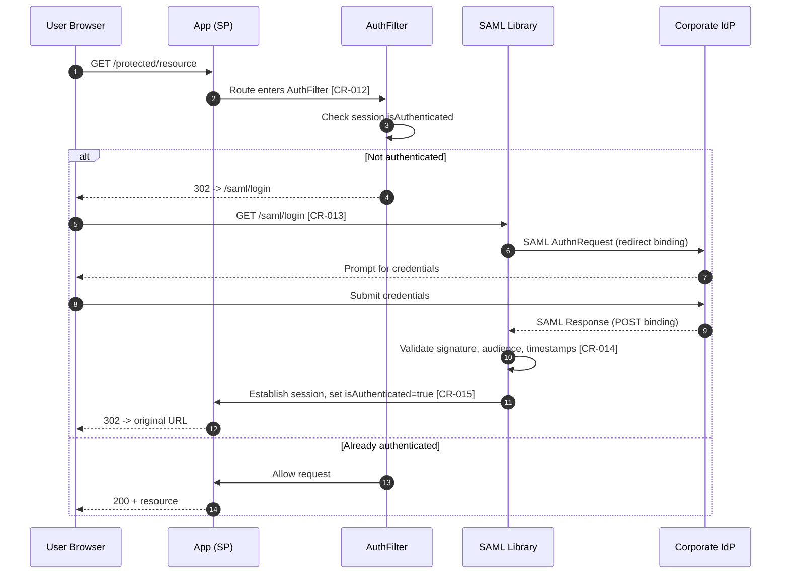
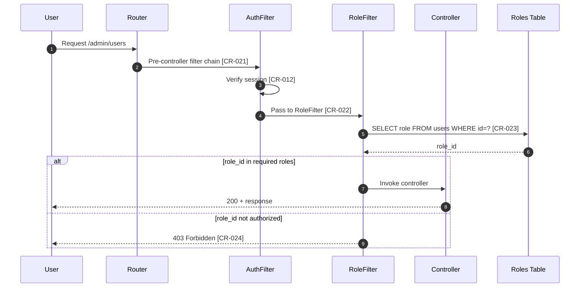
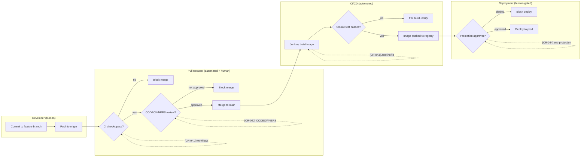
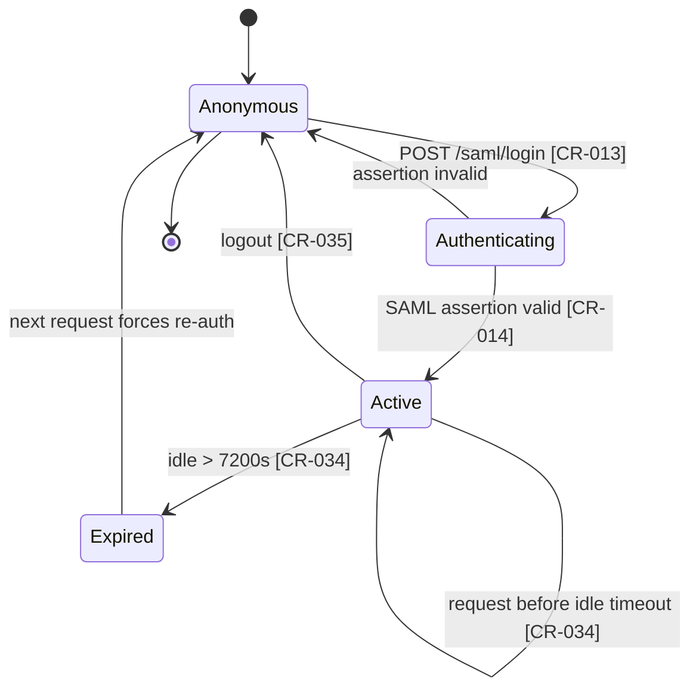
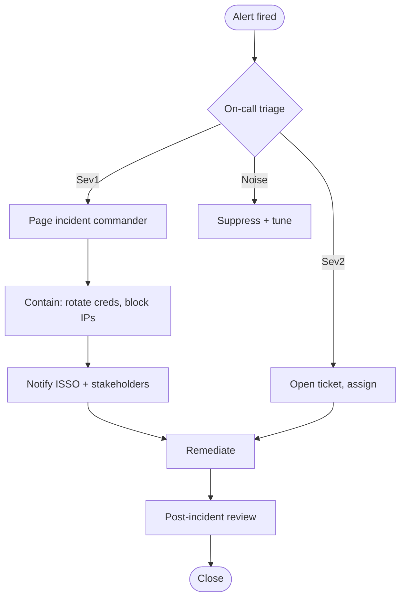
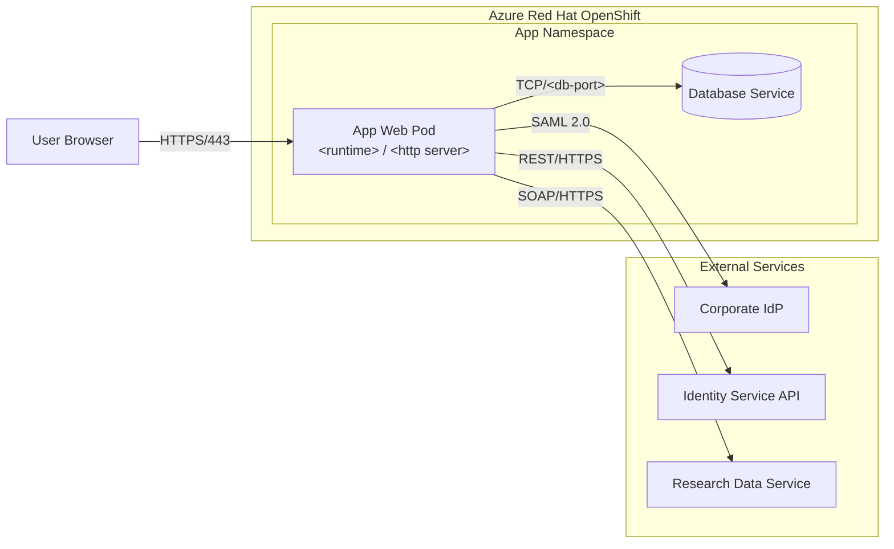

# Generation Patterns Reference

Templates and strategies for generating composite artifacts from repository sources.
Each section describes what to extract, how to organize it, and where to flag gaps.

## Table of Contents
1. [General Generation Rules](#general-generation-rules)
2. [Mermaid Diagram Templates](#mermaid-diagram-templates)
3. [Section 1: System Design Document](#section-1-system-design-document)
3. [Section 2: System Inventory](#section-2-system-inventory)
4. [Section 3: Configuration Management](#section-3-configuration-management)
5. [Section 4-5: Access Control & Authentication](#sections-4-5-access-control--authentication)
6. [Section 6: Audit Logging](#section-6-audit-logging)
7. [Section 7: Vulnerability Management](#section-7-vulnerability-management)
8. [Section 16: Network & Communications](#section-16-network--communications)
9. [Section 17: SDLC & Secure Development](#section-17-sdlc--secure-development)
10. [Section 19: Interconnections](#section-19-interconnections)

---

## General Generation Rules

### Source citation format — use `[CR-NNN]` tags, never inline paths

Every fact in a generated document must carry a citation, but the citation lives
in `CODE_REFERENCES.md` — not inline. In the narrative, use a stable
`[CR-NNN]` identifier and let the reader click through to the master reference
file. Maintain a running counter across the whole package so each ID is unique.

```markdown
The system uses PHP 8.3 as its runtime environment [CR-001].
Session timeout is set to 7200 seconds (2 hours) [CR-034].
Authentication is enforced via the AuthFilter middleware, which checks the session
`isAuthenticated` flag and redirects unauthenticated users to the login page [CR-012].
```

As you emit each `[CR-NNN]` tag, append a row to your in-memory reference list with:

| Field | Example |
|---|---|
| `id` | `CR-012` |
| `cited_by` | `05-authentication-session/authentication-session-evidence.md` |
| `file` | `app/Filters/AuthFilter.php` |
| `start_line` | 15 |
| `end_line` | 28 |
| `purpose` | Auth filter enforcement chain |

Step 7 of SKILL.md turns this list into `CODE_REFERENCES.md` with commit-pinned
permalinks when a GitHub/GitLab/Bitbucket remote is available.

**Citations may resolve to non-repo sources.** When sibling skills
(`ato-source-sharepoint`, `ato-source-aws`, `ato-source-azure`, `ato-source-smb`)
are enabled, they pre-register their own `[CR-NNN]` rows via staging batches in
`docs/ato-package/.staging/`. The narrative style is unchanged — you still write
`[CR-NNN]` inline — but the master `CODE_REFERENCES.md` table gains a `Source`
column whose value is `repo`, `sharepoint`, `aws`, `azure`, or `smb`. When you
generate a narrative that leans on cloud control-plane data (IAM roles, NSG
rules, Config compliance JSON), cite the pre-registered `[CR-NNN]` IDs from the
staging batches just as you would for repo files.

**Never** write `(Source: file.php, lines 15-28)` inside narrative text. The only
place file paths and line numbers belong is CODE_REFERENCES.md.

### Gap marker format

When information is required but not found:

```markdown
> **GAP**: No evidence of account lockout configuration found in the codebase.
> **Required by**: ARTIFACT-GUIDE Section 5 — "Account lockout threshold, duration,
>   and observation window"
> **Gap type**: REPO-FINDABLE
> **Suggested action**: Check the authentication provider (your SAML IdP or OIDC
>   provider) for lockout settings, or add lockout logic to the service that
>   currently owns authentication.
```

### When to generate vs. flag missing

**Generate** when you can extract at least 2-3 meaningful facts from the repo that
address the sub-item. Partial coverage with gaps marked is more useful than nothing.

**Flag as missing** when:
- Zero repo evidence exists for the sub-item
- The artifact is purely operational (training records, incident tickets)
- The artifact requires information from systems outside the repo

---

## Mermaid Diagram Templates

Whenever a generated document describes HOW a mechanism works in code, follow the
narrative paragraph with a Mermaid diagram. Pick the type that matches the shape
of the mechanism:

- **Sequence diagram** — request/response flows across actors (auth, SAML, API calls)
- **Flowchart / activity diagram** — processes with branches and decisions (CM gates,
  incident triage, input validation)
- **State diagram** — lifecycles (session states, record approval status, deployment rollout)
- **Swimlane flowchart** — human vs. automated responsibility (CM controls with
  `subgraph` per lane)

Every actor, step, or decision in the diagram should tie back to a `[CR-NNN]`
citation in the surrounding narrative. Place the Mermaid block immediately below
the paragraph it illustrates, not at the end of the document.

### Template 1: Authentication sequence diagram (SAML SP-initiated)

Use this when documenting SAML-based authentication. Relabel participants to
match the actual IdP and SP in the target repo. Each numbered step should map
to a `[CR-NNN]` in the narrative above.

````markdown

````

### Template 2: Authorization / role check sequence

Use for post-authentication authorization chains (role filters, RBAC guards).

````markdown

````

### Template 3: CM stage-gate flowchart with swimlanes

Use for the Configuration Management document. Subgraphs separate human vs.
automated controls so the assessor can see exactly where each type lives.

````markdown

````

### Template 4: Session lifecycle state diagram

Use when documenting how a session is created, renewed, and destroyed.

````markdown

````

### Template 5: Incident-response activity diagram

Use when the incident response narrative has decision branches (severity,
escalation).

````markdown

````

### Rules for Mermaid blocks

1. **Always fenced** as ` ```mermaid `. Don't invent dialects.
2. **Cite in the narrative, not inside the diagram**. Diagram labels should be
   human-readable; citations live in the paragraph above. If a step absolutely
   needs a citation on-diagram (as in Template 3), use a `.->` note anchor.
3. **Keep it legible** — under ~15 nodes per diagram. Split large mechanisms
   into multiple diagrams with separate narratives.
4. **No secrets in labels** — participant names should be roles ("Corporate IdP"), not
   URLs or credentials.
5. **Match actors to code**. If your diagram has a participant called
   `AuthFilter`, there must be a `[CR-NNN]` in the narrative that resolves to
   `app/Filters/AuthFilter.php` (or equivalent).

---

## Section 1: System Design Document

This is usually the most generatable section because architecture lives in the code.
**Always attempt to produce an architecture document** — even when no formal one exists,
the codebase contains enough information to reverse-engineer a useful starting point.

### Architecture document (reverse-engineered)

This is the single most valuable generated artifact. Produce it in three layers:

#### Layer 1: Software architecture pattern

Identify the pattern from directory structure and framework conventions:

| Directory pattern | Architecture | Common frameworks |
|---|---|---|
| `controllers/`, `models/`, `views/` | MVC | CodeIgniter, Rails, Laravel, Django, Spring MVC |
| `ViewModels/`, `Views/`, `Models/` | MVVM | SwiftUI, WPF, Android Jetpack |
| `handlers/`, `services/`, `repositories/` | Layered / Clean | Go services, Spring Boot, .NET |
| `commands/`, `queries/`, `events/` | CQRS / Event-Driven | Axon, MediatR, custom |
| `api/`, `graphql/`, `resolvers/` | API-first | Express, FastAPI, Apollo |
| `packages/` or `services/` (monorepo) | Microservices / Modular monolith | Nx, Turborepo, Lerna |
| `pages/`, `components/`, `hooks/` | Component-based SPA | React, Vue, Svelte |

**How to document it:**

```markdown
## Software Architecture

**Pattern**: Model-View-Controller (MVC)
**Framework**: CodeIgniter 4 (with parallel CodeIgniter 3 legacy runtime)

### Architectural Layers

| Layer | Directory | Responsibility | Key files |
|---|---|---|---|
| Controllers | `app/Controllers/` | Request handling, routing logic | Auth.php, Dashboard.php, Media.php |
| Models | `app/Models/` | Data access, business logic | UserModel.php, MediaModel.php |
| Views | `app/Views/` | HTML rendering, user interface | auth/login.php, dashboard/*.php |
| Filters | `app/Filters/` | Cross-cutting concerns (auth, CSRF) | AuthFilter.php, RoleFilter.php |
| Services | `app/Services/` | Business logic encapsulation | AuthService.php, MediaPathAuthorizationService.php |
| Config | `app/Config/` | Application configuration | Routes.php, Filters.php, ExternalServices.php |
```

*(Source: directory structure via `ls -R app/`.)*

> **Note.** The table above uses a CodeIgniter/PHP layout as a worked example. For other stacks, the same pattern applies with language-specific paths — e.g. `src/main/java/.../controller/` for Spring, `apps/<name>/views.py` for Django, `src/controllers/` for Nest, `internal/handler/` for Go. Adapt the row labels to the framework you find in the repo.

#### Layer 2: Infrastructure / deployment architecture

Extract from IaC, Docker, and K8s configs to produce a component topology:

1. **Read `docker-compose.yml`** — each `service:` block is a component. Document:
   - Service name, image, ports, volumes, dependencies (`depends_on`)
   - Network topology (which services talk to each other)

2. **Read Kubernetes/OpenShift manifests** — each Deployment/StatefulSet is a component:
   - Replicas, resource limits, health checks
   - Services and Ingress → how traffic reaches the component
   - Secrets/ConfigMaps → what configuration is injected
   - Network policies → who can talk to whom

3. **Read `.env.sample`** — each URL/endpoint variable is an external dependency:
   - Database URLs → data stores
   - API endpoints → external services
   - SMTP servers → email infrastructure
   - SAML/OAuth endpoints → identity providers

**Produce the deployment diagram in Mermaid.** Use `flowchart LR` (or `TD`) with
`subgraph` blocks to represent trust boundaries (cluster, namespace, external).
Label every edge with protocol and port.

````markdown

````

**Cite sources:** Every node in the diagram must correspond to a `[CR-NNN]` in the
narrative above it — for example, one citation pointing at `docker-compose.yml`
or the equivalent Kubernetes `Deployment.yaml` for the web pod, one at `.env.sample`
(or the equivalent env-var manifest) for each external endpoint.

#### Layer 3: Data architecture

Extract from database schemas, migrations, and ORM models:

1. **Schema scripts / migrations** → entity list with relationships
2. **ORM model definitions** → field types, constraints, relationships
3. **Route definitions** → what data flows between client and server
4. **External API configs** → what data flows to/from external systems

Produce a data flow summary:

```markdown
## Data Flows

| Flow | Source | Destination | Protocol | Data Type | Evidence |
|---|---|---|---|---|---|
| User login | Browser | Web App | HTTPS/SAML | Credentials | AuthService.*:15 |
| Auth assertion | Corporate IdP | Web App | SAML 2.0 | Identity attributes | saml-config sample |
| Application data | Web App | Database | TCP/&lt;db-port&gt; | Domain records | db-config:12 |
| Identity lookup | Web App | Identity Service API | HTTPS/REST | User profile | ExternalServices.*:42 |
| Research data | Web App | Research Data Service | SOAP | Study data | .env.sample:RESEARCH_API_* |
```

### Component inventory extraction

Walk these sources in order:
1. `README.md` — often has a system description
2. `Dockerfile` / `docker-compose.yml` — runtime components, services, databases
3. `composer.json` / `package.json` / etc. — application dependencies
4. Kubernetes/OpenShift manifests — deployment architecture
5. `.env.sample` — external service integrations

For each component found, document:
- Name and version
- Role in the system
- Where it runs (container, pod, external service)
- What it connects to

### Auth design extraction

1. Find the auth entry point (login controller/route)
2. Trace the auth flow:
   - How credentials are submitted
   - How they're validated (local DB? SAML? OIDC? LDAP?)
   - How sessions are created
   - How sessions are checked on subsequent requests
3. Find authorization checks (role filters, permission checks)
4. Document the flow as a sequence

### Crypto extraction

1. Check TLS/SSL configuration in web server configs
2. Check for encryption at rest in database configs
3. Find any application-level encryption (hashing passwords, encrypting fields)
4. Check SAML/OAuth certificate configurations
5. Look for key management patterns

---

## Section 2: System Inventory

### Software Bill of Materials (SBOM) generation

Parse each package manifest to produce a table:

```markdown
| Component | Version | Type | Purpose | License |
|---|---|---|---|---|
| &lt;runtime&gt; (e.g. PHP / Python / Node / JVM) | 8.3 | Runtime | Application runtime | &lt;license&gt; |
| &lt;framework&gt; (e.g. CodeIgniter / Django / Express / Spring) | 4.6.x | Framework | Web application framework | MIT |
| &lt;SAML library&gt; | 1.19.9 | Library | SAML authentication | LGPL |
| &lt;database&gt; (e.g. MySQL / Postgres / SQL Server) | 8.0.x | Database | Primary data store | &lt;license&gt; |
```

Sources:
- `Dockerfile` FROM directive = base image version
- `composer.json` require section = PHP dependencies
- `package.json` dependencies = JavaScript dependencies
- `docker-compose.yml` services = infrastructure components

### Infrastructure inventory

From Kubernetes/Docker configs, extract:
- Container images and versions
- Service ports and protocols
- Volume mounts (persistent storage)
- Resource limits (CPU, memory)
- Replica counts
- Health check configurations

---

## Section 3: Configuration Management

**Always produce a CM process document with stage gates.** CI/CD pipelines ARE the
change management process for code changes, and they contain exactly the evidence
an assessor needs: what's automated, what requires human intervention, and where the
control points are.

### Stage gate and control point extraction

This is the core of the CM artifact. Walk each CI/CD config file and classify every
step as automated or human-controlled:

#### Step 1: Map the pipeline stages

Read each CI/CD config and extract the ordered stages:

**GitHub Actions** (`.github/workflows/*.yml`):
```yaml
# Look for these patterns:
on: pull_request          # Trigger = PR event
on: push: branches: main  # Trigger = merge to main
on: workflow_dispatch      # Trigger = manual
on: schedule               # Trigger = scheduled

jobs:
  build:                   # Stage name
    runs-on: ubuntu-latest
    steps:                 # Individual checks within the stage
      - run: npm test      # Automated quality gate
      - run: npm audit     # Automated security gate

  deploy:
    needs: [build]         # Dependency = build must pass first
    environment: production # Environment protection = human approval gate
```

**Jenkins** (`Jenkinsfile`, `pipeline.properties`):
```groovy
// Look for these patterns:
stage('Build') { ... }          // Stage
input message: 'Deploy?'        // Human approval gate
when { branch 'main' }          // Conditional execution
```

**GitLab CI** (`.gitlab-ci.yml`):
```yaml
# Look for these patterns:
stages: [build, test, deploy]
deploy:
  when: manual                   # Human-triggered stage
  environment: production
```

#### Step 2: Classify each control point

For each step in the pipeline, classify it:

```markdown
## Change Management Control Points

### Pre-commit Controls (Developer Workstation)

| Control | Type | Enforced? | Evidence |
|---|---|---|---|
| ESLint code style | Automated | Advisory (pre-commit hook) | `package.json` husky config |
| Format check | Automated | Advisory (pre-commit hook) | `.editorconfig`, prettier config |

*(Advisory = developer can bypass with --no-verify. Document this.)*

### Pull Request Controls (Before Merge)

| Control | Type | Enforced? | Evidence |
|---|---|---|---|
| Code review | **Human** | Yes (CODEOWNERS) | `.github/CODEOWNERS` |
| npm audit | Automated | Yes (blocks merge) | `.github/workflows/dependency-audit.yml` |
| Secret scanning | Automated | Yes (blocks merge) | `.github/workflows/secret-scanning.yml` |
| Config validation | Automated | Yes (blocks merge) | `.github/workflows/deployment-config-validation.yml` |
| Unit tests | Automated | Yes (blocks merge) | CI job `test` step |

### Deployment Controls (After Merge)

| Control | Type | Enforced? | Evidence |
|---|---|---|---|
| Build verification | Automated | Yes | Jenkins/CI build step |
| Smoke test | Automated | Yes | `scripts/ci4-smoke-check.sh` |
| Promotion approval | **Human** | Depends on config | Environment protection rules |
| Production deploy | **Human-initiated** | Yes | Manual trigger or approval |
```

#### Step 3: Produce the stage gate flow diagram

Use the swimlane flowchart format from Template 3 in the Mermaid Diagram Templates
section above. Never ASCII. The swimlanes must cleanly separate human-controlled
stages from automated ones so the assessor can see at a glance where each control
type lives. Every gate node should tie to a `[CR-NNN]` in the narrative (workflow
file, CODEOWNERS, Jenkinsfile, environment protection config).

#### Step 4: Document what's NOT in the pipeline

Important for gap analysis — what CM controls are missing:
- No SAST/DAST in pipeline? → GAP
- No container image scanning? → GAP
- No deployment approval gate? → GAP
- No rollback procedure documented? → GAP
- No change advisory board (CAB) referenced? → GAP (likely OPERATIONAL)
- No security impact analysis step? → GAP (likely POLICY)

### Baseline configuration extraction

Document the baseline by examining:
- Dockerfile (base image = OS baseline)
- Config files committed to the repo (application baseline)
- Hardening references (STIG, CIS mentions in docs or configs)
- Linter/formatter configs (code quality baseline)

---

## Sections 4-5: Access Control & Authentication

### Role model extraction

Find all role definitions in the codebase:
1. Database migrations that create roles/permissions tables
2. Config files that define role mappings
3. Code that checks roles (middleware, filters, guards)
4. Route definitions with role requirements

Produce a role matrix:

```markdown
| Role ID | Role Name | Access Level | Routes/Functions Accessible |
|---|---|---|---|
| 1 | Admin | Privileged | All routes, admin dashboard |
| 4 | Standard User | Non-privileged | Dashboard, media access |
```

### Session configuration extraction

Extract from framework config:
- Session driver (files, database, redis)
- Session lifetime / expiration
- Cookie settings (secure, httponly, samesite)
- CSRF protection configuration

---

## Section 6: Audit Logging

### Log coverage analysis

Scan the codebase for all logging calls and categorize:

```markdown
| Event Category | Logged? | Evidence | File:Line |
|---|---|---|---|
| Login success | YES/NO | `log_message('info', 'User logged in')` | auth.php:45 |
| Login failure | YES/NO | — | — |
| Access denied | YES/NO | — | — |
| Data modification | YES/NO | — | — |
| Admin action | YES/NO | — | — |
| Configuration change | YES/NO | — | — |
```

### Log configuration extraction

From logging config:
- Log level threshold
- Log format (structured? plain text?)
- Log destination (file, syslog, external service)
- Log rotation settings
- Log retention period

---

## Section 7: Vulnerability Management

### CI/CD security scanning inventory

Extract from workflow configs:

```markdown
| Scan Type | Tool | Trigger | Severity Threshold | Evidence |
|---|---|---|---|---|
| Dependency audit | npm audit | On PR | High | `.github/workflows/dependency-audit.yml` |
| Secret scanning | Gitleaks | Daily + PR | Any | `.github/workflows/secret-scanning.yml` |
| SAST | — | — | — | **GAP**: No SAST tool configured |
| Container scan | — | — | — | **GAP**: No container scanning |
| DAST | — | — | — | **GAP**: No dynamic scanning |
```

---

## Section 16: Network & Communications

### Network architecture extraction

From deployment configs, extract:
- Exposed ports and protocols
- Service-to-service communication paths
- External network connections
- TLS termination points
- Load balancer configuration

### Security control extraction

From application configs:
- CSRF protection settings
- Content Security Policy headers
- Secure cookie flags
- HTTPS enforcement
- Input validation/filtering

From infrastructure:
- Network policies (K8s)
- Security groups (cloud)
- Ingress/egress rules

---

## Section 17: SDLC & Secure Development

### Pipeline documentation

Extract from CI/CD configs and produce:

```markdown
## Development Pipeline

### Stages
1. **Code** → Developer writes code on feature branch
2. **Commit** → Pre-commit hooks run (Husky: lint, format)
3. **PR** → Automated checks:
   - npm audit (dependency vulnerabilities)
   - Gitleaks (secret scanning)
   - Deployment config validation
4. **Review** → Code review required (CODEOWNERS)
5. **Merge** → To main branch after approval
6. **Build** → Docker image built (OpenShift BuildConfig)
7. **Deploy** → Staged deployment (dev → test → prod)
```

### Test coverage extraction

From test configs and directories:
- Test framework(s) in use
- Test directory structure
- Number of test files
- Types of tests (unit, integration, feature)
- Coverage configuration (if any)

---

## Section 19: Interconnections

### External service inventory

Parse `.env.sample` and code for external connections:

```markdown
| Service | Protocol | Direction | Purpose | Evidence |
|---|---|---|---|---|
| Corporate IdP | SAML 2.0 | Outbound | User authentication | `config/saml/authsources.sample` |
| Identity Service API | HTTPS/REST | Outbound | User identity lookup | `app/Config/ExternalServices.*:<field>` |
| Research Data Service | SOAP | Outbound | Data sync | `.env.sample:RESEARCH_API_*` |
| SMTP | SMTP/TLS | Outbound | Email notifications | `.env.sample:SMTP_*` |
| Database | TCP/&lt;db-port&gt; | Internal | Primary database | `docker-compose.yml` |
```

For each connection, flag gaps:
- Is there an ISA/MOU documented?
- Is there a security assessment of the provider?
- Are the ports/protocols justified?

### Feeding the inventory from cloud control-plane data

When the AWS or Azure siblings are enabled, the external-service inventory in
Section 19 should be augmented with runtime evidence from the cloud control
plane — not just what `.env.sample` declares. The siblings write JSON exports
into `{family}/evidence/` with source prefixes (`aws_*`, `azure_*`) and pre-
register citations in `.staging/`. When generating the Section 19 narrative,
weave those in alongside repo-sourced rows:

| Cloud source | Example artifacts feeding Section 19 |
|---|---|
| AWS IAM | `aws_iam-account-summary.json`, role trust policies for cross-account access |
| AWS Config | `aws_config-compliance.json` — rule evaluations for interconnection-relevant controls |
| AWS Security Hub | `aws_securityhub-findings-summary.json` — cross-account / cross-VPC findings |
| AWS VPC peering / TGW | `aws_vpc-peering-connections.json`, transit gateway attachments |
| Azure RBAC | `azure_role-assignments.json` — cross-tenant / cross-subscription access |
| Azure NSG | `azure_nsg-rules.json` — ingress/egress to external endpoints |
| Azure Private Link / peering | `azure_private-endpoints.json`, VNet peerings |

Each row in the generated table cites the pre-registered `[CR-NNN]` from the
sibling's staging batch. The assessor can then click through to the live
console link in `CODE_REFERENCES.md` or read the JSON export in `evidence/`.
Cloud-sourced rows don't replace repo-sourced rows — they complement them,
because the repo tells you what the app *intends* to connect to and the
control plane tells you what the environment *actually allows*.
