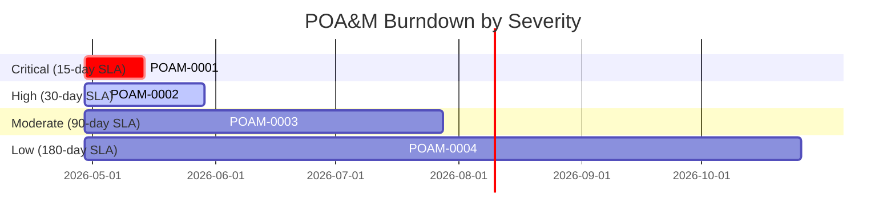

# ATO POA&M Generator

This skill consumes an existing `docs/ato-package/` (produced by `ato-artifact-collector`, optionally also `ato-remediation-guidance` and `ato-vulnerability-scanner`) and emits up to three new files: a Markdown POA&M, a federal-submission-friendly CSV, and a CA-5 dual-route copy of the Markdown. It is **not** part of the default ATO workflow. It runs only when the user explicitly asks for a POA&M, either by triggering this skill directly or by passing `--poam` to the orchestrator.

## When to run

- The user asks "generate a POA&M" / "give me the plan of action and milestones" / "I need a CA-5 deliverable" / "turn the remediation list into a tracker"
- The orchestrator finishes a collection invoked with `--poam`
- An ISSO needs a federal-submission-shaped CSV to copy into their authoring tool

## When NOT to run

- The package doesn't exist yet (`docs/ato-package/` is missing or empty). Ask the user to run `ato-artifact-collector` first.
- The user wants raw remediation steps (file paths + diffs) rather than a tracker — that's `ato-remediation-guidance`, not this skill.
- The user wants the gap inventory or a deeper investigation of why a finding exists — direct them to the existing `*-gap-analysis.md` documents in the package.

## Hard rules

1. **Read-only on the package.** This skill reads `CHECKLIST.md`, `INDEX.md`, optionally `REMEDIATION_GUIDANCE.md`, and optionally any `controls/RA-risk-assessment/evidence/RA-5/vulnerability-scan-*.md`. It writes exactly three new files. It does not modify any existing evidence file, narrative, INDEX.md, CHECKLIST.md, CODE_REFERENCES.md, or REMEDIATION_GUIDANCE.md.
2. **Do not overwrite `04-poam/poam-gap-analysis.md`.** That slot is canonical for collected/narrative gap analysis. Use `poam-generated.md` and `poam-generated.csv` for generated output.
3. **Stable POAM-NNNN across runs.** On re-run, parse the existing `poam-generated.md` for prior POAM-NNNN → Source Identifier mappings. Reuse stable IDs when the same source-identifier set is present. Allocate new IDs at the high-water mark. Closed weaknesses move to a `## Closed Items` tail section with `Closed (date)` rather than being deleted.
4. **No fabrication.** If a row needs a Point of Contact / Resources Required / Asset and none is derivable, write `<TBD by ISSO>` literally. Do not invent names, hours, or budgets.
5. **Verbatim advisory text only.** Vulnerability descriptions copied from `vulnerability-scan-*.md` stay in the same fenced/blockquoted form they had in the source. Do not paraphrase advisory text.
6. **CSV and Markdown stay in sync.** Same column order, same row order, same content (CSV escapes Markdown formatting; e.g. `**bold**` becomes `bold`). The CSV is the federal-submission deliverable; the Markdown is the human-readable companion.

## Inputs

The skill expects to find, at the repo root:

```
docs/ato-package/
├── INDEX.md                                                  ← required
├── CHECKLIST.md                                              ← required
├── CODE_REFERENCES.md                                        ← optional (resolves CR-NNN labels)
├── REMEDIATION_GUIDANCE.md                                   ← optional, recommended
├── ssp-sections/04-poam/                                     ← target directory (created if absent)
└── controls/
    ├── CA-assessment-authorization/evidence/CA-5/            ← target directory (created if absent)
    └── RA-risk-assessment/evidence/RA-5/
        └── vulnerability-scan-*.md                           ← optional, picks the most recent
```

If `docs/ato-package/` is missing or contains fewer than 5 SSP-section directories AND fewer than 10 control-family directories, halt with an error message instructing the user to run `ato-artifact-collector` first — same gate as `ato-remediation-guidance`.

If `REMEDIATION_GUIDANCE.md` is missing, the POA&M is sourced from CHECKLIST RED/YELLOW rows + any vuln-scan findings only; emit a banner in the report header noting the reduced fidelity.

If both `REMEDIATION_GUIDANCE.md` and any `vulnerability-scan-*.md` are missing, the POA&M is sourced from CHECKLIST alone; emit a stronger reduced-fidelity banner.

## Workflow

### Step 1 — Build the source-row inventory

Read all three input streams in parallel and build a normalized in-memory row list. Each source row has:

```
{
  source_id:     "RG-007" | "VS-0019" | "CR-042" | "CHECK-AC-2",  # typed prefix
  origin:        "remediation" | "vuln-scan" | "checklist-gap",
  control_ids:   ["AC-2(4)"],
  severity_hint: "High" | "Moderate" | "Low" | null,
  effort_hint:   "S" | "M" | "L" | null,
  weakness_name: "Account inactivity disable not automated",
  weakness_desc: "Multi-sentence; verbatim from source for vuln-scan rows",
  recommended_fix: "Add scheduled cron / DB query …",
  evidence_files: ["controls/AC-access-control/evidence/AC-2/...md"],
  detected_at:   "2026-04-29",       # when source said the gap was first observed
  acceptance_criteria: ["[ ] cron job exists", "[ ] test asserts disable …"]
}
```

**From REMEDIATION_GUIDANCE.md**: parse every `### RG-NNN —` heading. Extract Control, Type, Effort, "Why this matters", "What to change" file paths, "How to verify" checkboxes (these become Milestones), and "Evidence after fix" (these become Evidence Files).

**From vulnerability-scan-{date}.md** (latest dated file): parse every `### VS-NNNN —` heading. Extract Severity, CWE, CVE/GHSA, Tool, Location, Description, Recommended fix, Controls. Use the "Advisory" fenced block verbatim as `weakness_desc`.

**From CHECKLIST.md**: for every RED or YELLOW row not already covered by an RG-NNN or VS-NNNN (deduplicate by control ID + section), create a `CHECK-{control}` source row with `weakness_name` = sub-item title, `weakness_desc` = the row's notes, `severity_hint` = `Moderate` (RED) or `Low` (YELLOW). These are the residual gaps that have no remediation guidance yet.

### Step 2 — Merge and assign POAM-NNNN

Group source rows that describe the same weakness:

- Same Control ID + same `weakness_name` → one POAM row covering all source rows
- Same Control ID + RG-NNN that explicitly references VS-NNNN in its body → merge

Each merged group becomes one POAM row with:

- `source_identifier` = comma-separated typed IDs (e.g. `RG-007, VS-0019`)
- `origin` = `hybrid` if the group has multiple types; otherwise the single origin
- All other fields derived from the group's most-specific source

**ID allocation (idempotency)**:

1. If `docs/ato-package/ssp-sections/04-poam/poam-generated.md` exists, parse the top "POAM-NNNN ↔ Source Identifier" mapping table from its frontmatter region (a fenced YAML block — see Output structure below). Build a `{normalized_source_set → POAM-NNNN}` map.
2. For each merged group in this run, normalize the source identifier set (sort, dedupe). Look up the map.
   - **Hit**: reuse the existing POAM-NNNN.
   - **Miss**: allocate next available POAM-NNNN above the high-water mark.
3. Source-set entries from prior runs that are not present in this run go into the `## Closed Items` tail section with `Status: Closed`, `Closed: {YYYY-MM-DD}`, dropping their previous Open status.

A `--no-merge` arg (passed via the user's prompt as text — there's no flag parser; honor "ignore prior IDs" / "regenerate cleanly" in the user's request) forces full regeneration starting at POAM-0001.

### Step 3 — Compute derived columns

For each POAM row, compute:

- **Severity**: hierarchy is `vuln-scan CVSSv3 → RG effort proxy (L=High, M=Moderate, S=Low) → CHECKLIST status (RED=Moderate, YELLOW=Low)`. Use the strongest signal available.
- **Scheduled Completion Date**: `Original Detection Date + N days` where `N = {Critical: 15, High: 30, Moderate: 90, Low: 180}`. (Critical maps to a 15-day SLA per common federal practice; assessors may ask for a tighter window.)
- **Original Detection Date**: from the source's `detected_at` if available; otherwise the date this POA&M was first generated.
- **NIST 800-53 Controls**: comma-separated list of control IDs, most-specific first (`AC-2(4)` before `AC-2`).
- **Asset / System Component**: parse from the source's evidence-file path or recommended-fix file path; if multiple, list the dominant one. If unparseable, `<TBD by ISSO>`.
- **Milestones**: from RG acceptance criteria (each `[ ]` checkbox becomes one milestone with target date `original_detection_date + 0.5 * (scheduled_completion_date - original_detection_date)` for the first checkbox, scaled linearly for subsequent ones — i.e. milestones evenly spaced before the scheduled completion). For VS-only rows, `Milestone 1: Apply recommended fix and re-scan`.
- **Resources Required**: `<TBD by ISSO>` (POA&M completion responsibility).
- **Point of Contact**: `<TBD by ISSO>`.
- **Status**: `Open` for new rows, `In Progress` if a prior run had this row and a `Status: In Progress` annotation exists in the prior file (preserve user-applied status edits across regeneration), `Closed` for rows in the Closed Items section.
- **Comments**: empty by default; preserve any free-text annotation from the prior file.

### Step 4 — Write the outputs

Three files, all created (parents created with `mkdir -p` as needed):

1. `docs/ato-package/ssp-sections/04-poam/poam-generated.md` — primary
2. `docs/ato-package/ssp-sections/04-poam/poam-generated.csv` — federal-submission CSV
3. `docs/ato-package/controls/CA-assessment-authorization/evidence/CA-5/poam-generated.md` — copy of #1 (CA-5 is the canonical control for "Plan of Action and Milestones")

The Markdown and CSV must contain the same rows in the same order. The CSV strips Markdown emphasis and uses standard RFC-4180 quoting (double-quote any field containing a comma, newline, or double-quote; escape internal double-quotes by doubling).

### Step 5 — Return summary

Return to the caller a short summary:

```
POA&M generated.

| Status | Count |
|---|---|
| Open | N |
| In Progress | N |
| Closed (this run) | N |
| **Total tracked** | N |

Files written:
- docs/ato-package/ssp-sections/04-poam/poam-generated.md
- docs/ato-package/ssp-sections/04-poam/poam-generated.csv
- docs/ato-package/controls/CA-assessment-authorization/evidence/CA-5/poam-generated.md

Sources merged: N from REMEDIATION_GUIDANCE.md, N from vulnerability-scan-{date}.md, N from CHECKLIST.md.
```

## Output structure

### `poam-generated.md`

```markdown
# Plan of Action and Milestones — Generated

> **Repository**: {repo name}
> **Commit SHA**: {SHA from CODE_REFERENCES.md header, if present}
> **Generated**: {ISO-8601 timestamp}
> **Sources merged**: REMEDIATION_GUIDANCE.md (N items), vulnerability-scan-{date}.md (N findings), CHECKLIST.md (N residual gaps)

> **Control reference**: CA-5 (Plan of Action and Milestones), with cross-references to RA-5 (vulnerability findings) and SI-2 (flaw remediation tracking).

> **Reduced-fidelity notice** *(only present if REMEDIATION_GUIDANCE.md and/or vulnerability-scan-{date}.md were missing)*: This POA&M is sourced from CHECKLIST gaps alone. For richer remediation milestones, run `ato-remediation-guidance` and `ato-vulnerability-scanner` and re-generate.

> **ISSO action items**: Replace every `<TBD by ISSO>` value with your environment's actuals (Point of Contact, Resources Required, Asset/System Component, refined Scheduled Completion Date). User-applied status edits (`Open → In Progress`) are preserved across regeneration; do not lose them by removing the row.

## ID Stability Map

```yaml
# This block is parsed on re-run to preserve POAM-NNNN across regenerations.
# Do not hand-edit; the skill regenerates it on each run.
id_map:
  POAM-0001: ["RG-001", "CR-014"]
  POAM-0002: ["VS-0001"]
  POAM-0003: ["CHECK-AC-2(3)"]
  # ...
```

## Summary

| Status | Count |
|---|---|
| Open | N |
| In Progress | N |
| **Open + In Progress (active)** | N |
| Closed (since prior run) | N |



## Open Items

| ID | Weakness | Source | Origin | Asset | Controls | Severity | Detected | Due | POC | Status |
|---|---|---|---|---|---|---|---|---|---|---|
| POAM-0001 | Account inactivity disable not automated | RG-001, CR-014 | hybrid | `app/Filters/AuthFilter.php` | AC-2(4), AC-2 | High | 2026-04-29 | 2026-05-29 | <TBD by ISSO> | Open |
| POAM-0002 | CVE-2024-12345 in `requests@2.25.0` | VS-0001 | vuln-scan | `requirements.txt` | RA-5, SI-2, SR-3 | High | 2026-04-29 | 2026-05-29 | <TBD by ISSO> | Open |
| POAM-0003 | Quarterly account review not evidenced | CHECK-AC-2(3) | checklist-gap | <TBD by ISSO> | AC-2(3) | Moderate | 2026-04-29 | 2026-07-28 | <TBD by ISSO> | Open |

## Per-row narratives

### POAM-0001 — Account inactivity disable not automated

- **Source Identifier**: RG-001, CR-014
- **Origin**: hybrid (remediation + repo evidence)
- **Asset / System Component**: `app/Filters/AuthFilter.php` (and the cron / scheduler that should drive disable)
- **NIST 800-53 Controls**: AC-2(4), AC-2
- **Severity**: High
- **Original Detection Date**: 2026-04-29
- **Scheduled Completion Date**: 2026-05-29
- **Resources Required**: <TBD by ISSO>
- **Point of Contact**: <TBD by ISSO>
- **Status**: Open

**Weakness**: Inactive accounts are not automatically disabled. Remediation guidance RG-001 documents the change.

**Recommended fix**: see `REMEDIATION_GUIDANCE.md#rg-001` for the concrete file path, change, and acceptance test.

**Milestones**:
- [ ] {YYYY-MM-DD} — Add scheduled disable job in `app/Console/Kernel.php`
- [ ] {YYYY-MM-DD} — Add test in `tests/Feature/InactiveAccountDisableTest.php` asserting after-90d disable
- [ ] {YYYY-MM-DD} — Re-run `ato-vulnerability-scanner` and confirm no new finding
- [ ] {scheduled completion} — Update CHECKLIST row AC-2(4) from RED to GREEN

**Evidence after fix**: `controls/AC-access-control/evidence/AC-2(4)/automated-disable-job.md`, updated `CHECKLIST.md` row.

**Comments**: <free-text; preserved across regeneration>

### POAM-0002 — CVE-2024-12345 in `requests@2.25.0`

- **Source Identifier**: VS-0001
- **Origin**: vuln-scan
- ...

(continue per row...)

## Closed Items

(Empty on first run.)

| ID | Weakness | Source | Closed | Reason |
|---|---|---|---|---|
| POAM-00XX | (prior weakness) | (source) | YYYY-MM-DD | No longer reported by source after re-scan |

## Cross-references

- `INDEX.md` — package index
- `CHECKLIST.md` — control-by-control status
- `REMEDIATION_GUIDANCE.md` — concrete developer actions (RG-NNN ↔ POAM-NNNN)
- `controls/RA-risk-assessment/evidence/RA-5/vulnerability-scan-{date}.md` — vulnerability findings (VS-NNNN ↔ POAM-NNNN)
- `controls/CA-assessment-authorization/evidence/CA-5/poam-generated.md` — copy of this file under CA-5 evidence
- `CODE_REFERENCES.md` — repo / sibling citations (CR-NNN ↔ POAM-NNNN via RG citations)
```

### `poam-generated.csv`

Standard RFC-4180 CSV with these columns in order:

```
ID,Weakness Name,Weakness Description,Source Identifier,Origin,Asset/System Component,NIST 800-53 Controls,Severity,Original Detection Date,Scheduled Completion Date,Milestones,Resources Required,Point of Contact,Status,Comments
```

Multi-value cells (Source Identifier, Controls, Milestones) are encoded as `;`-joined within the CSV cell. Markdown formatting is stripped.

### `controls/CA-assessment-authorization/evidence/CA-5/poam-generated.md`

A byte-for-byte copy of `ssp-sections/04-poam/poam-generated.md`. Two files for two routes (CA-5 control evidence + SSP section 04 narrative). The orchestrator's INDEX.md picks up both paths.

## Failure modes

| Failure | Behavior |
|---|---|
| Package missing | Halt with: "ATO package not found. Run `ato-artifact-collector` first." |
| `04-poam/poam-generated.md` exists but is unparseable (corrupted ID Stability Map) | Halt with: "Existing POA&M ID map is corrupted. Run with `--no-merge` to regenerate cleanly (this will allocate new POAM-NNNN values, breaking traceability)." Do not silently regenerate. |
| Source files contain conflicting severity for the same weakness | Pick the highest severity. Note in Comments: "Severity reconciled from {sources}: highest applied." |
| No RED/YELLOW CHECKLIST rows, no RG-NNN, no VS-NNNN | Emit a near-empty POA&M with the reduced-fidelity banner and a single row noting "no open weaknesses detected at scan time" — do not emit zero-row CSV. |

## What this skill does NOT do

- It does not modify `REMEDIATION_GUIDANCE.md`, `CHECKLIST.md`, `CODE_REFERENCES.md`, INDEX.md, or any vulnerability-scan dated file.
- It does not generate remediation guidance — for that, run `ato-remediation-guidance` first.
- It does not run vulnerability scans — for that, run `ato-vulnerability-scanner` first.
- It does not invent Point of Contact names, Resource estimates, or Asset names. Always `<TBD by ISSO>` when unknown.
- It does not push the POA&M to a federal submission system. The CSV is the submission artifact; the user copies it into their authoring tool.
